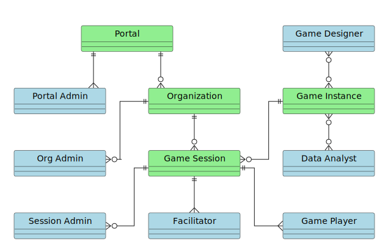

# 1. Scope and Stakeholders

[Back to Table of Contents](../../README.md)

Last Updated: 2025-09-21

__Changelog:__
 - 2025-08-09 - Document creation.
 - 2025-08-12 - Added role diagram, made roles more clear, changed 'stakeholders' into 'end-users'.
 - 2025-09-18 - Clarify how portal administrator has access to all functions in the system (https://github.com/averbraeck/gscg-design/issues/38)
 

## 1.1. Project goals

The goal of the project is to develop a new version of the Global Supply Chain Game (GSCG) that is described on the website [https://gscg.org](https://gscg.org). The original version was developed and described in the dissertation by van Houten [1]. The game implementation is outdated and not compliant with the latest insights into distributed simulation. The game was also heavily dependent on Java software running locally on the players' computers, which required difficult installation. The intention of the new implementation is to be fully Web-based on the client side.

The idea is to re-develop the game design and implementation with ideas from agent-based modeling and simulation [2] and from distributed simulation [3]. Since multiple players interact through the game in real time, it is a distributed simulation where time management and data management plays an important role. In order to provide flexibility in the game design, the simulation should be data-driven [4], which means that a database defines the parameters for the game. Game state should be persistent, so a game session can be interrupted and continued later. A crash of either the game server, or a game client for a player should not be fatal. 

### References

- [1] S.P.A. van Houten. A suite for developing and using business games: Supporting supply chain business games in a distributed context. Doctoral Thesis, TU Delft, 2007. [https://resolver.tudelft.nl/uuid:4541bdf9-7e62-4047-9ac5-0656607bc806](https://resolver.tudelft.nl/uuid:4541bdf9-7e62-4047-9ac5-0656607bc806).
- [2] D.W.F. van Krevelen, M.E. Warnier, F. Brazier, A. Verbraeck and T. Corsi, "Transparency, consistency and modularity of strategic reasoning: An agent architecture for interactive business simulations," Proceedings of the 2011 Winter Simulation Conference (WSC), Phoenix, AZ, USA, 2011, pp. 1612-1623, [doi:10.1109/WSC.2011.6147878](https://doi.org/10.1109/WSC.2011.6147878).
- [3] IEEE Std 1516-2010. IEEE Standard for Modeling and Simulation (M&S) High Level Architecture (HLA). [doi:10.1109/IEEESTD.2010.5553440](https://doi.org/10.1109/IEEESTD.2010.5553440). 
- [4] Y. Huang. Automated Simulation Model Generation. Doctoral Thesis, TU Delft, 2013. [doi:10.4233/uuid:dab2b000-eba3-42ee-8eab-b4840f711e37](https://doi.org/10.4233/uuid:dab2b000-eba3-42ee-8eab-b4840f711e37).

## 1.2 End-users

In the GSCG project, there are a number of end-users or roles (all in blue). The end-users have a relation to the overall portal on a server, and potentially to an organization, game instance and/or game session (all in green).

A short definition of each end-user is given below.

### Portal administrator
The portal administrator can create organizations, users and games. Because the portal administrator can allocate roles for organizations and games, the portal administrator indirectly has access to all functions of the other end users, by allocating a role to itself.

### Game designer
The game designer is responsible for creating and removing games from the database, and setting the game parameters such as organizations, scenarios and allowable strategies for the players. 

### Organization administrator
The organization administrator manages the users and game sessions for the organization. There can be multiple organizations in the game portal, where users from one organization do not have access to the games, players, and results of another organization.

### Session administrator
The session administrator is in control of user management and session management. The session administrator can create and delete player and facilitator accounts for the game session, and allocate players and facilitators to a game session.

### Session facilitator 
The session facilitator can add users to a game session and remove them, start and stop a game session, determine the speed of the game, and inject game events into the game. Additionally, the facilitator takes care of the briefing and debriefing of the game, for which game state or game results (scores) might be needed.

### Game player
The game player is playing a game session by managing a company such as a distributor in the supply chain. The player observes the state of the organization, makes decisions, and enters the decision parameters into the web interface, so they can be processed by the supply chain simulation.

### Data analyst
The data analyst can analyze the data of a single game, or over a series of games. Both the transactions and the scores are available to the data analyst. Anonymization of pseudonymization of the data is important for privacy reasons. Potentially an analyst is limited to view data for one organization only.

## 1.3 Constraints
