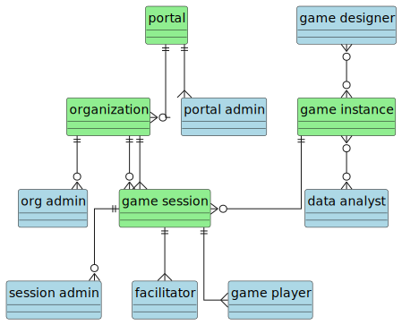
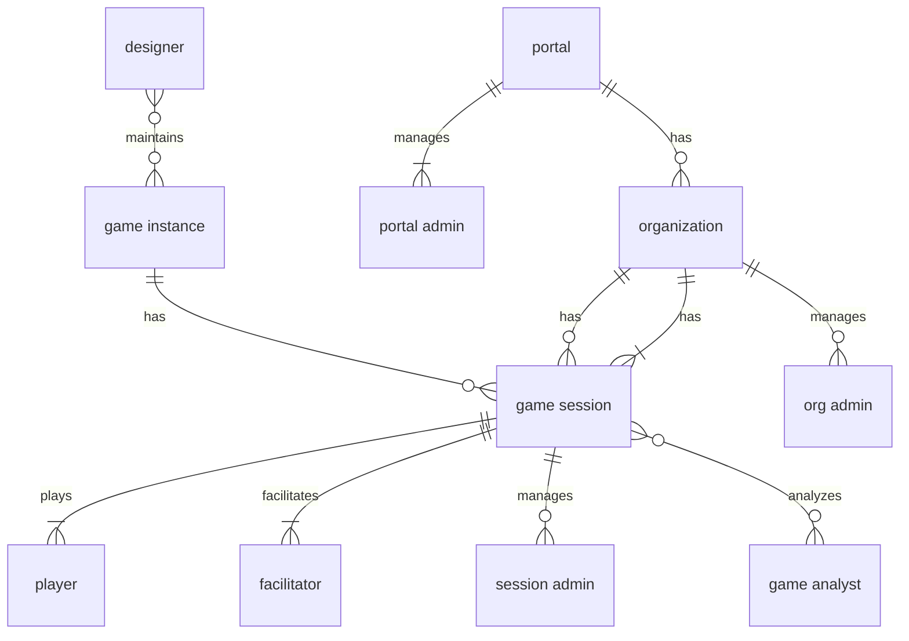

# 1. Scope and Stakeholders

## 1.1. Project goals

The goal of the project is to develop a new version of the global Supply Chain game. The original version was developed and described in the dissertation by van Houten [1]. The game implementation is outdated and not compliant with the latest insights into distributed simulation. The game was also heavily dependent on Java software running locally on the players' computers, which required difficult installation. The intention of the new implementation is to be fully Web-based on the client side.

The idea is to re-develop the game design and implementation with ideas from agent-based modeling and simulation [2] and from distributed simulation [3]. Since multiple players interact through the game in real time, it is a distributed simulation where time management and data management plays an important role. In order to provide flexibility in the game design, the simulation should be data-driven [4], which means that a database defines the parameters for the game. Game state should be persistent.

### References

- [1] S.P.A. van Houten. A suite for developing and using business games: Supporting supply chain business games in a distributed context. Doctoral Thesis, TU Delft, 2007. url: https://resolver.tudelft.nl/uuid:4541bdf9-7e62-4047-9ac5-0656607bc806
- [2] D.W.F. van Krevelen, M.E. Warnier, F. Brazier, A. Verbraeck and T. Corsi, "Transparency, consistency and modularity of strategic reasoning: An agent architecture for interactive business simulations," Proceedings of the 2011 Winter Simulation Conference (WSC), Phoenix, AZ, USA, 2011, pp. 1612-1623, doi: 10.1109/WSC.2011.6147878.
- [3] IEEE Std 1516-2010. IEEE Standard for Modeling and Simulation (M&S) High Level Architecture (HLA).
- [4] Y. Huang. Automated Simulation Model Generation. Doctoral Thesis, TU Delft, 2013. https://doi.org/10.4233/uuid:dab2b000-eba3-42ee-8eab-b4840f711e37

## 1.2 Stakeholders

In the GSCG project, there are a number of stakeholders. The stakeholders have a relation to the overall portal on a server, and potentially to an organization, game instance and/or game session.

A short definition of each stakeholder (user) is given below.

### Game player
The game player is playing a game session by managing an organization in the supply chain. The player observes the state of the organization, makes decisions, and enters the decision parameters into the web interface, so they can be processed by the supply chain simulation.

### Session facilitator 
The session facilitator can add users to a game session and remove them, start and stop a game session, determine the speed of the game, and potentially inject game events into the game. Additionally, the facilitator takes care of the briefing and debriefing of the game, for which game state or game results (scores) might be needed.

### Session administrator
The session administrator is in control of user management and session management. The administrator can create and delete player and facilitator accounts, create and delete game sessions, and allocate players and facilitators to a game session.

### Game designer
The game designer is responsible for creating and removing games from the database, and setting the game parameters such as organizations, scenarios and allowable strategies for the players. 

### Organization administrator
The organization administrator manages the users and game sessions for the organization. 

### Portal administrator
The portal administrator can create organizations, users and games. In a sense, the portal administrator has access to all functions of the other stakeholders, except the player's functions since that involves another interface.

### Data analyst
The data analyst can analyze the data of a single game, or over a series of games. Both the transactions and the scores are available to the data analyst. Anonymization of pseudonymization of the data is important for privacy reasons.
