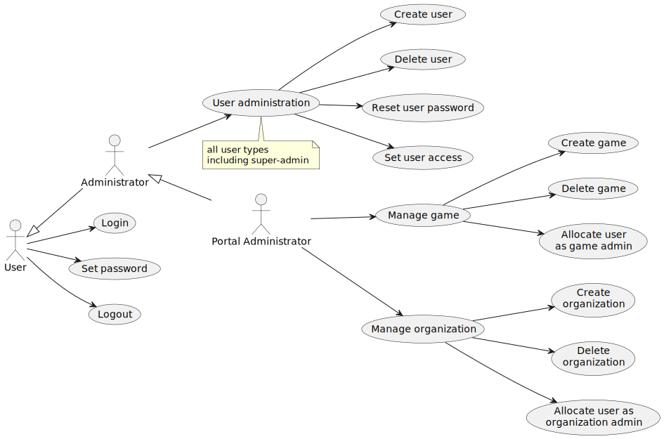
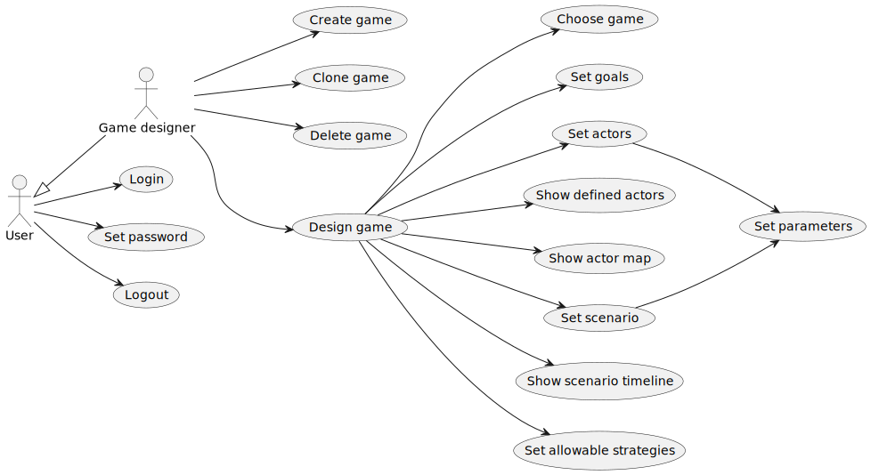
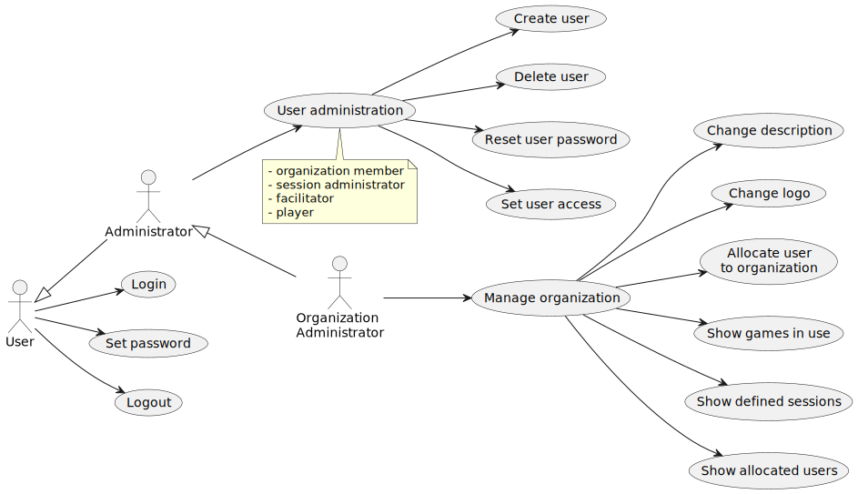
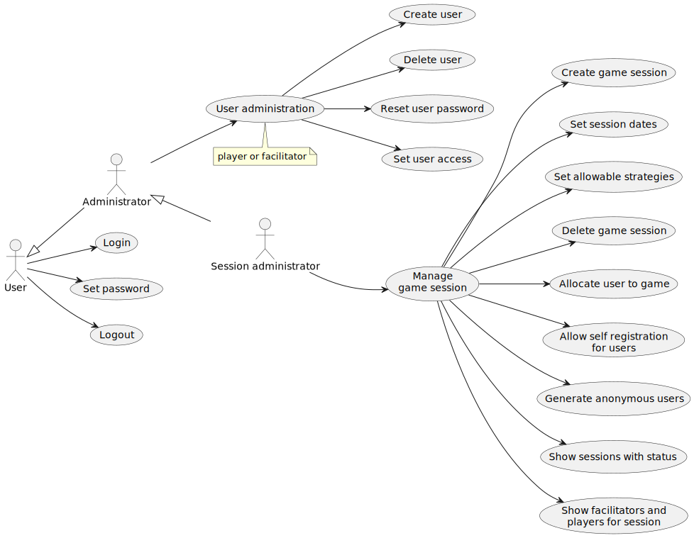
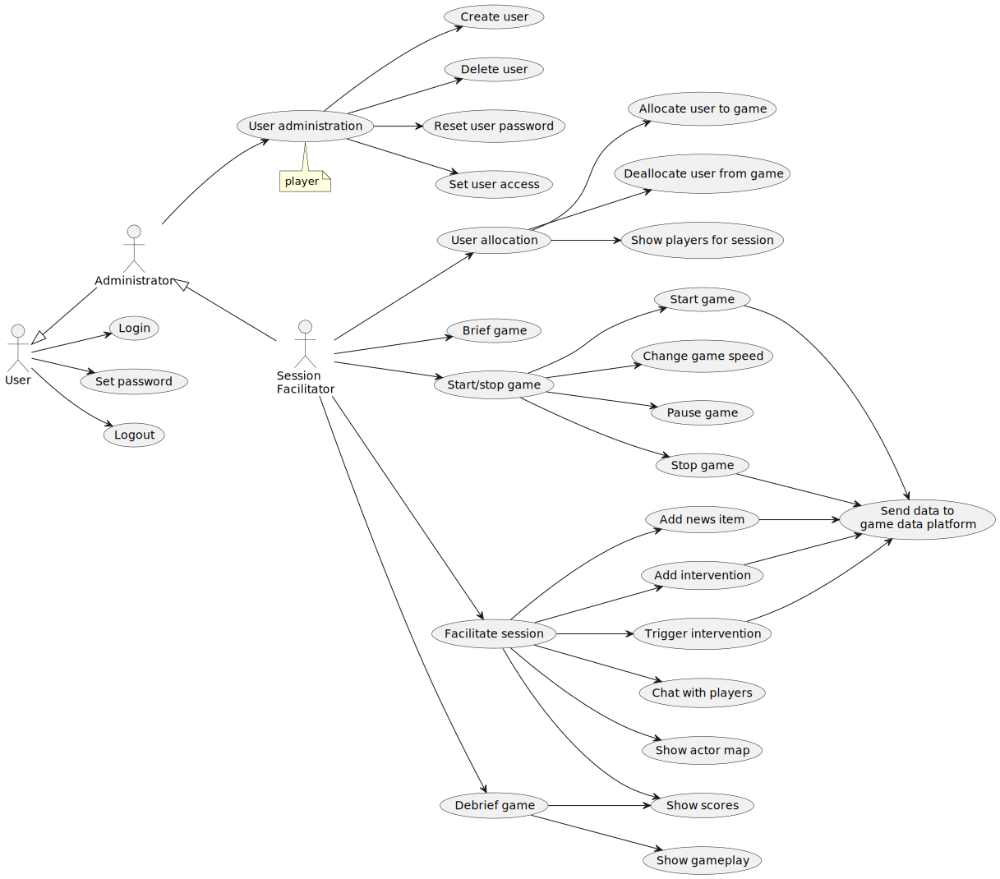
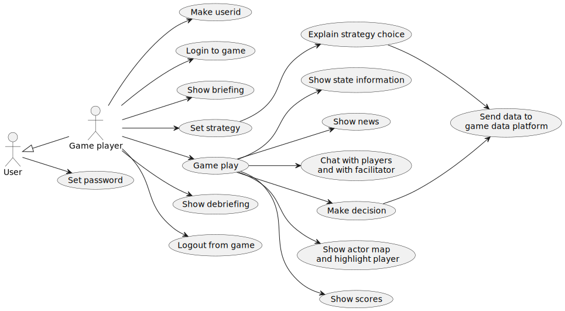

# GSCG Use Cases

Last Updated: 2025-04-30

__Changelog:__
 - 2025-04-30 - Added display functionality: [Issue #5](https://github.com/averbraeck/gscg-design/issues/5). 
 - 2025-04-30 - Added 'Pause game': [Issue #4](https://github.com/averbraeck/gscg-design/issues/4). 
 - 2025-04-30 - Added "Administrator" role according to [Issue #3](https://github.com/averbraeck/gscg-design/issues/3). 
 - 2025-04-30 - Include options for "show scores" activity
 - 2025-04-29 - First set of use cases added
 - 2025-04-03 - Document Creation
 
 
## 1. Portal administration
Portal administration takes care of creating (super) users, designing organizations, and allocating roles such as game designers or organization administrators. In portal administration, new games can be created as well, and unused games can be deleted.

 
 
## 2. Game design
In game design, the actual game play of the game is determined. 
 

## 3. Organization administration
Organization administration takes care of creating users for their organization, and allocating roles such as facilitators or session managers.

## 4. Session administration
Session design takes care of the definition of a new game session (game play) and allocating facilitators. It is possible to set self registration for users, or to 

## 5. Session facilitation

## 6. Game play

## 7. Game data analysis

