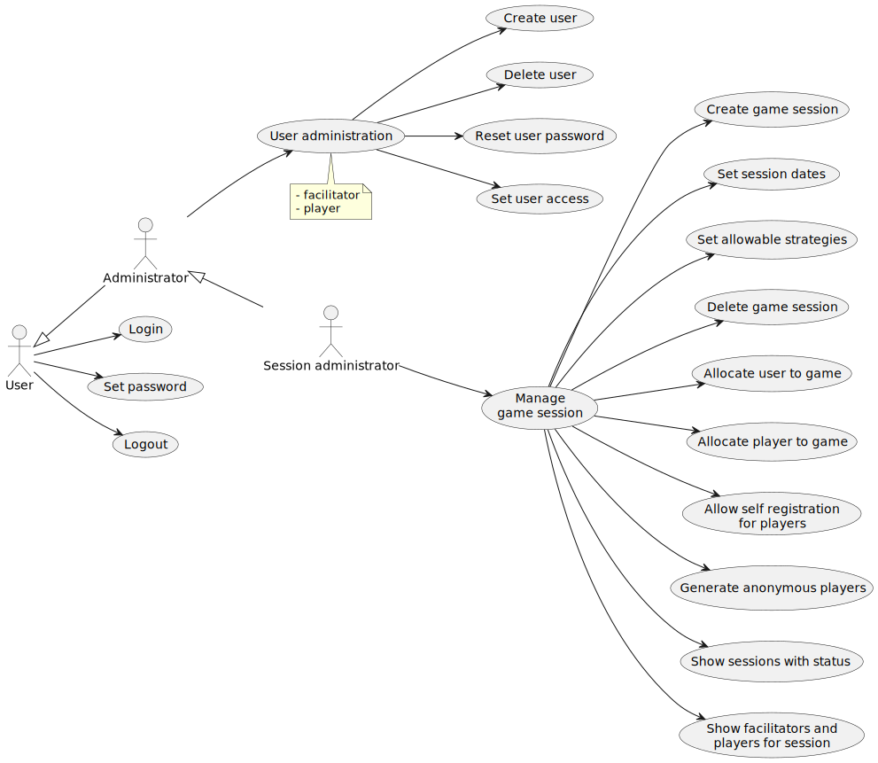

# 2. GSCG Use Cases

Last Updated: 2025-08-26

__Changelog:__
 - 2025-04-03 - Document Creation
 - 2025-04-29 - First set of use cases added
 - 2025-04-30 - Added display map function: [Issue #6](https://github.com/averbraeck/gscg-design/issues/6).
 - 2025-04-30 - Added display functionality: [Issue #5](https://github.com/averbraeck/gscg-design/issues/5). 
 - 2025-04-30 - Added 'Pause game': [Issue #4](https://github.com/averbraeck/gscg-design/issues/4). 
 - 2025-04-30 - Added "Administrator" role according to [Issue #3](https://github.com/averbraeck/gscg-design/issues/3). 
 - 2025-04-30 - Include options for "show scores" activity
 - 2025-05-01 - Strategy setting by player: [Issue #11](https://github.com/averbraeck/gscg-design/issues/11).
 - 2025-05-01 - Login/logout to the portal: [Issue #10](https://github.com/averbraeck/gscg-design/issues/10).
 - 2025-05-01 - Registration for game sessions: [Issue #9](https://github.com/averbraeck/gscg-design/issues/9).
 - 2025-05-01 - Removed labels on the arrows: [Issue #13](https://github.com/averbraeck/gscg-design/issues/13).
 - 2025-05-01 - Added export functions to analytics: [Issue #8](https://github.com/averbraeck/gscg-design/issues/8).
 - 2025-05-01 - Added communication function: [Issue #7](https://github.com/averbraeck/gscg-design/issues/7).
 - 2025-05-01 - Define allowable player strategies: [Issue #12](https://github.com/averbraeck/gscg-design/issues/12).
 - 2025-08-13 - Add chapter number for SE-step "2" to the headers in the document
 - 2025-08-26 - Add missing function in use case diagram for game design (consistency with requirements)
 - 2025-08-29 - Improve clarity of game terms in use cases [Issue #21](https://github.com/averbraeck/gscg-design/issues/21).
 - 2025-08-29 - Re-allocate tasks for session admin and facilitator [Issue #24](https://github.com/averbraeck/gscg-design/issues/24).
 
 
## 2.1. Portal administration
Portal administration takes care of creating (super) users, designing organizations, and allocating roles such as game designers or session administrators. In portal administration, new games can be created as well, and unused games can be deleted.

 
 
## 2.2. Game design
In game design, the actual game play of the game instance is determined. 
 

## 2.3. Organization administration
Organization administration takes care of creating users for their organization, and allocating roles such as session administrators or facilitators.

## 2.4. Session administration
Session administration takes care of defining the details for a new game session (game play) and allocating facilitators. It is possible to set self registration for users, or to define users beforehand.

## 2.5. Session facilitation
Session facilitation takes care of starting, pausing and stopping of the game, as well as defining game speed. Briefing and debriefing are part of the facilitation. Facilitators can trigger pre-defined actions in the game, and they can communicate with the players. Note that the game can be played in a completely distributed setting, where a built-in communication function can be of use.

## 2.6. Game play
In game play, players are able to register for the game, or log on when they have a pre-defined user account. The players study the briefing before the game, and the debriefing after the game play. During game play, players are shown the pre-defined information such as events, news, as well as dynamic state information. The most important role for the players is to set their strategy, and to make decisions that they enter into the platform. Players can communicate with other players, since the game can be played in a completely distributed setting.

## 2.7. Game data analysis

