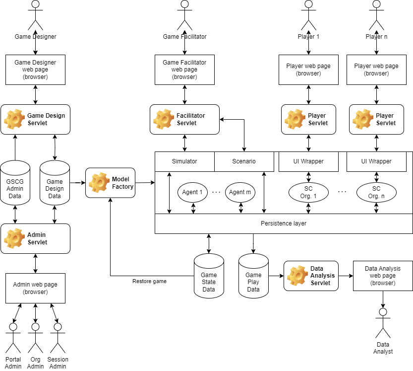

# High-level component breakdown

Last updated: 25-0802925

__Changelog:__
 - 2025-08-25 - Document creation
 - 2025-08-26 - Update of the diagram with clearer communication with the persistence layer

## Architectural diagram
 
On a very high level, the overall GSCG application looks as follows:

All roles as identified in the use cases interact with the applications through a web page. On the server, several applications (e.g., servlets) are running for the different roles. All data is persisted in one or more databases. Three different data set are identified:
.
- GSCG data with the organizational details, users, and game designs and game settings per organization
- Game state data with the persisted game so it can be restarted at a later date or after a crash.
- Game play data for game data analytics (potentially through an external service such as gamedata.nl). 

A rough indication of the simulation itself is given in the diagram as well. The following important components are identified:

- Simulator for time management of the simulation.
- Persistence layer for data management of the simulation.
- Scenario for controlling the way that the game play unfolds.
- Agents 1 through m for automated actions of organizations that are not player-controlled.
- Supply chain organizations 1 through n for actions that are controlled by players.
- User Interface (UI) wrappers to control the organizations by the players.
