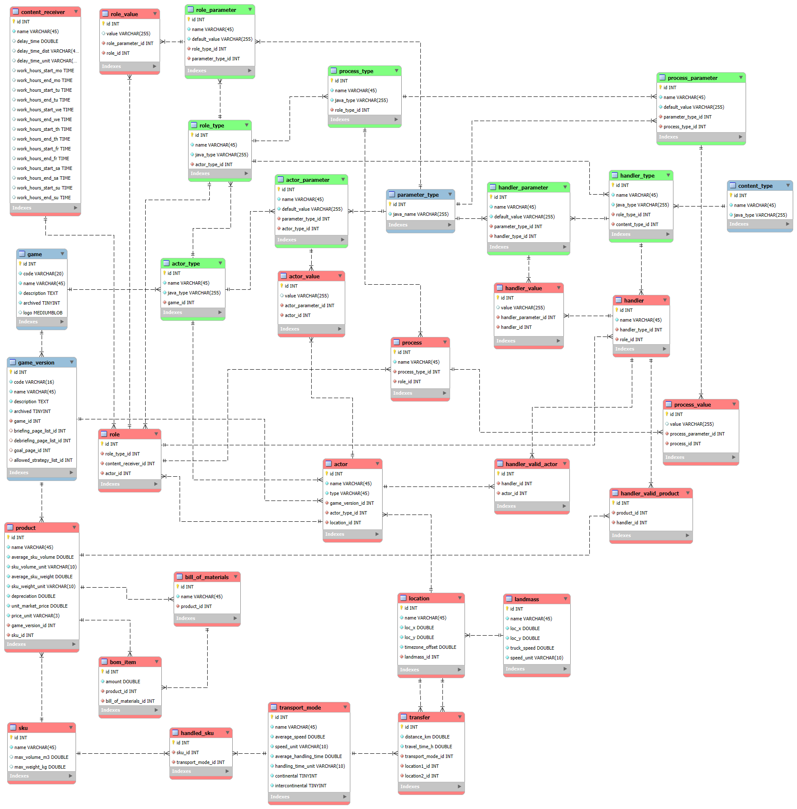
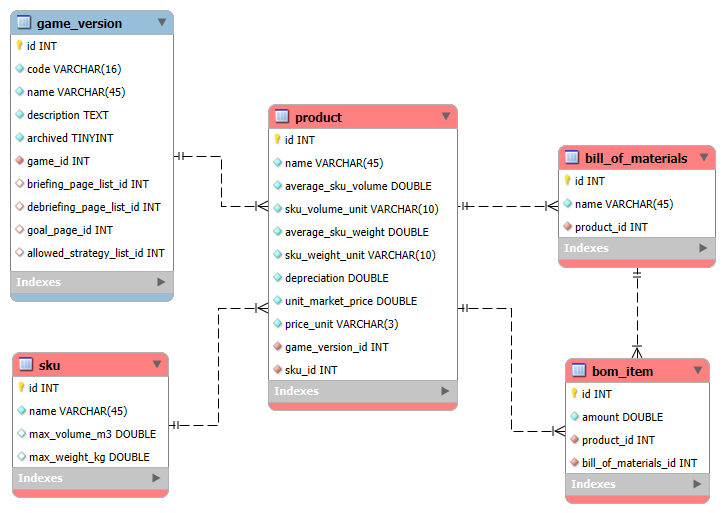
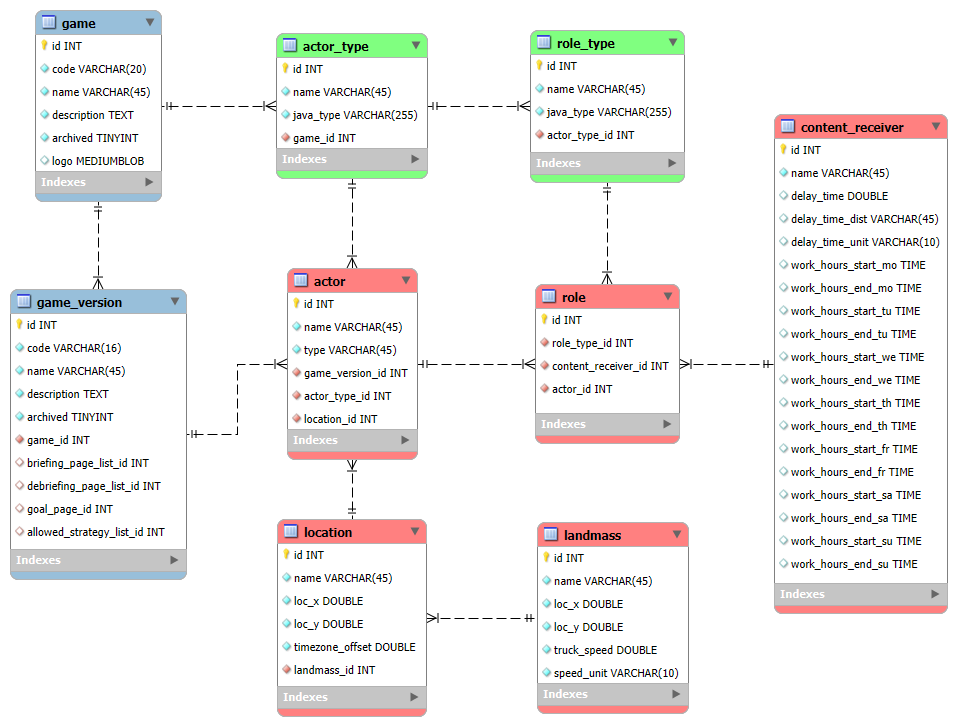
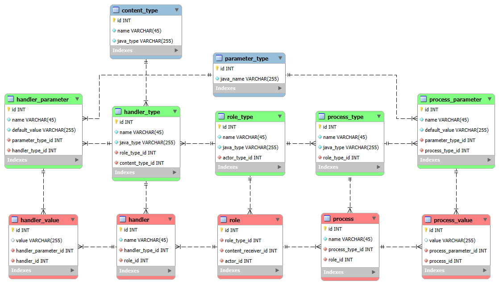

# 4.1. Database design

Last Updated: 2025-08-26

__Changelog:__
 - 2025-08-11 - Document creation
 - 2025-08-26 - Update with more detail about the data layers
 - 2025-08-26 - Made the terminology consistent with the architecture document
 - 2025-08-26 - Added main tables for GSCG Admin data
 - 2025-08-27 - Added design for GSCG Admin Data database tables
 - 2025-08-27 - Added design for Game Design Data database tables

## 4.1.1. High-level database design

The GSCG database is designed in three separate 'compartments' that are related, but managed by different roles:

1. **GSCG Admin data** with the organizations and users and their access rights.
2. **Game Design data** with the defined game instances with their actors, parameters, scenarios and player strategies.
3. **Game State data** with game sessions, game state, and game results

The results from the game can also be sent to the external data platform [gamedata.nl](https://gamedata.nl). In a sense, this defines a fourth data set:

4. **Game Play data** with game sessions, game state, and game results

## 4.1.2. GSCG Admin data

The GSCG Admin data supports the roles, use cases and requirements for the Portal Administrator, Organization Administrator, and Session Administrator. Important tasks are user administration, game administration, organization administration, and session administration. This leads to the following envisioned tables in the database:

- `organization` with the data for an organization that can define and play games.
- `user` with the data of someone who can log into one of the apps for GSCG. Note that a `player` is not necessarily a `user`, since they can be anonymous. A user can have a special characteristic `portal_admin` for portal administrators, who can create and delete instances of `organization` and a `game`, and can allocate the `game_role` for the game designer and `organization_role` for the organization administrator. Also the portal_admin is the only user who can make a `game` available to an `organization`.
- `organization_role` with the roles that a `user` can fulfill for the `organization`. One of the roles is to be the organization administrator, who can allocate roles to oher users for the organization.
- `game` as a placeholder for the definition of a game. `game` is related to the tables where the game designer role (a `user` with a `game_role`) can define and update one or more instances of `game_version`.
- `game_version` as a version of the game. Multiple versions with differences can exist. Game versions are not by definition tied to a specific `organization`, allowing games to be played by multiple organizations.
- `game_role` connecting a game designer (a `user`) to a `game`.
- `organization_game` defining that a particular `organization` has access to a `game`, so the `organization` can instantiate a `game_session`.
- `game_session` is a frozen instance of a `game_version` that can be played on certain dates. It has allocated `players` and one or more game facilitators. A facilitator is a `user` with a certain role for that `game_session`.
- `game_session_role` defines the instances of `user` who can act as game facilitators, or session administrators.
- `player` contains the properties of self-generated game players, or game players generated by the game facilitator or session administrator. Since players can be anonymous, a `player` is not necessarily a persistent `user` in the database, but it can be.

The design of the GSCG Admin data tables looks as follows:

## 4.1.3. Game design data

Game design data contains all data necessary to create and start a game. The database from the previous GSCG project was extremely complicated, with multiple layers defining software templates for actor definitions and their parameters on one layer, and the game definition and parameter values on another layer. This made the database complex, and instantiation slow. The database and the code to be executed do have a relation, of course. A database record (or set of records) defining an actor should contain the relevant properties for that actor as it is defined in the code. In that sense, the database 'mirrors' the simulation objects that have to be instantiated. The old database design was as follows:

Defining a game was a multi-month project due to the complexity of the database. In the design for this project, it might therefore be good to take a more lean approach, while keeping flexibility and maintainability. The tables for the game will be described in a number of steps below.

The overall diagram (with a couple or relations left out) is still complicated. Blue types refer to the Admin tables. Green tables define a game without values for the parameters. These tables set-up a rough scaffold for the game. Red tables define the details for the game, such as locations, distances, and values for the parameters of the actors, handlers, and autonomous processes.

Let's break down the database into several sub-components:

### Product tables

The product tables define the product, sku, and bill-of-materials:

- `product` gives the main characteristics of a product in the game or simulation. It specifies the name, the sock keping unit (`sku`), the average volume and weight (with units), the depreciation as a fraction per day, and a (starting / average) unit market price per `sku`.
- `sku` defines the way that the product is typically transported, such as on a pallet, in a 20 ft or 40 ft container, in a box, as a unit, etc. Each of the sku types has a maximum volume and weight, defining how many `product` instances fit in one `sku`.
- `bill_of_materials` defines the assembly of a `product` from semi-finished products or raw materials. The `bill_of_materials` uniquely belongs to a product and has multiple instances of a `bom_item`. Note that the `bill_of_materials` for a `product` van be `null`.
- `bom_item` is one product that is needed to assemble into another product, with the `amount` of `product` that is needed as one of its attributes.

The partial relations look as follows:

### Actor and Role tables

The actor table defines the organizations (agents) in the game with their location, whereas the role specifies the processing per type of decision that has to be made. The tables and relations look as follows:

- `actor_type` is a reference to an exisiting Java implementation of a type of actor in the simulation library. Therefore, it contains a reference to a `java_type`. The `actor_type` is defined on the game-level, since different instances of `game_version` can have a different set of defined actors.
- `actor` is the instantiation of an `actor_type` in the `game_version`. It has a `location` and one or more instances of `role`.
- `role_type` defines a role for an `actor_type` such as Purchasing, Selling, Producing, Banking or Transporting in the simulation library. Therefore, it contains a reference to a `java_type`.
- `role` is the instantiation of an `role_type` in the `game_version`. The `role` has a `content_receiver` that specifies when content (messages) can be received and how long it takes to process.
- `content_receiver` is a simple specification of the delay that occurs when receiving content (messages).
- `location` specifies an (x,y) or (lon,lat) position for the `actor`. It is located on a `landmass`.
- `landmass` is important, since trucks and trains cannot transport goods between landmasses, only on landmasses. For quick calculations on a landmass, the average truck speed is given for the landmass.

The partial relations look as follows:

> [!NOTE]
> The definition of `content_receiver` can probably be extended with versions that have weekend closure, that work office hours in a certain time zone, etc.

### Actor and Role parameter/value tables

The actors and roles have parameters that need to be defined in the database. Every parameter has a type and a value for the game instance. The `actor_type`, `actor`, `role_type` and `role` have already been defined above. The tables and relations look as follows:

- `parameter_type` defines the java types that can be used, such as `int`, `double`, `DistContinuous`, `DistDiscrete`, `Speed`, `Length`, etc. Note that the definition is 'blue', which means that it is defined outside of the `game` or `game_version`. 
- `actor_parameter` belongs to an `actor_type` and indicates which parameters can or should be defined for an `actor` instance.
- `actor_value` provides the value of an `actor_parameter` for an `actor` instance.
- `role_parameter` belongs to a `role_type` and indicates which parameters can or should be defined for a `role` instance.
- `role_value` provides the value of a `role_parameter` for a `role` instance.

The partial relations look as follows:

### Handler and Process tables

The `handler` is the rule class for an actor that takes care of handling a certain `content_type`, such as an `Order`, a `RequestForQuote`, a `Payment` or a `Shipment`. A `process` is the definition of an autonomous process. The autonomous process in the simulation is not triggered by the receipt of a content message, such as the handler, but it acts autonomously, often based on a gien frequency. An example is a marker that buys products on a regular basis, or a Make-to-Stock producer of goods that makes its goods available to the market, irrespective of demand. The tables `role_type` and `role` have already been defined above.

- `parameter_type` defines the java types that can be used, such as `int`, `double`, `DistContinuous`, `DistDiscrete`, `Speed`, `Length`, etc. Note that the definition is 'blue', which means that it is defined outside of the `game` or `game_version`. 
- `handler_type` links to the definition of the handler in Java through the `java_type` field. It is linked to the `role_type` hat is defined on the level of a `game`.
- `handler` is a specific instantiation of the `handler_type` for a `role`, which is defined on the level of a `game_version`. 
- `content_type` is the type of message that the `handler` can handle in the simulation. Note that the definition is 'blue', which means that it is defined outside of the `game` or `game_version`. 
- `handler_parameter` belongs to a `handler_type` and indicates which parameters can or should be defined for a `handler` instance.
- `handler_value` provides the value of a `handler_parameter` for a `handler` instance.
- `process_type` links to the definition of the autonomous process in Java through the `java_type` field. It is linked to the `role_type` hat is defined on the level of a `game`.
- `process` is a specific instantiation of the `process_type` for a `role`, which is defined on the level of a `game_version`. 
- `process_parameter` belongs to a `process_type` and indicates which parameters can or should be defined for a `process` instance.
- `process_value` provides the value of a `process_parameter` for a `process` instance.

The partial relations look as follows:

Additionally, handlers can be restricted from which actors they process messages (e.g., take an order), and for which products they process messages (e.g., take an order):

> [!NOTE]
> The `handler_valid_actor` now works on the `actor` instance level. Maybe the restriction should be defined on the `actor_type` level. As an example, a personal client can typically not buy products from a factory. Factory is an `actor_type` with many instances. Maybe two restrictions can be added: one for `actor`, and one for `actor_type`.

### Transport tables

Transport modes and distances are provided in the transport tables. The `location` and `landmass` have already been defined above.

- `transport_mode` defines a transport mode, such as `Truck`, `Rail`, `Air` or `Ship`. Variants of these transport modes with different characteristics can of course also be defined.
- `handled_sku` indicates which type of packaging for products are handled by the `transport_mode`. A ship dies not take aircraft pallets, and an airplane cannot transport a 40 ft ISO container. The table links `sku` to `transport_mode` for the valid sku's that can be transported.
- `transfer` defines a link in the transport network. It indicates you can transport goods (products) from `location` A to `location` B with a certain `transport_mode`. An indication of the distance and travel time is provided as well. 

> [!NOTE]
> Typically, the supply chain model will be set-up as a hub-and-spoke network. Actors are connected to the nearest hub per transport mode, such as ports, airports and rail terminals. Trucking on a landmass can be estimated using the `truck_speed` attribute in the `landmass` definition using a rough estimate of the distance between the two locations on the landmass.

## 4.1.4. Game state data

