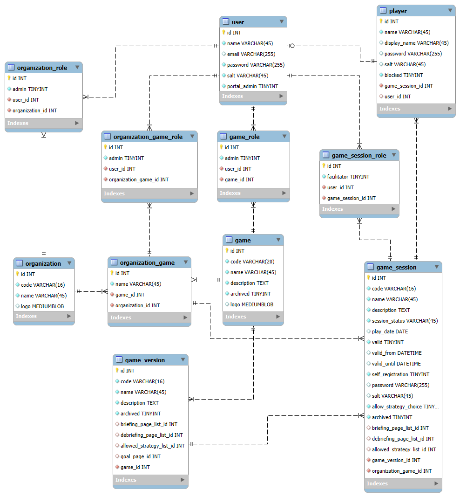
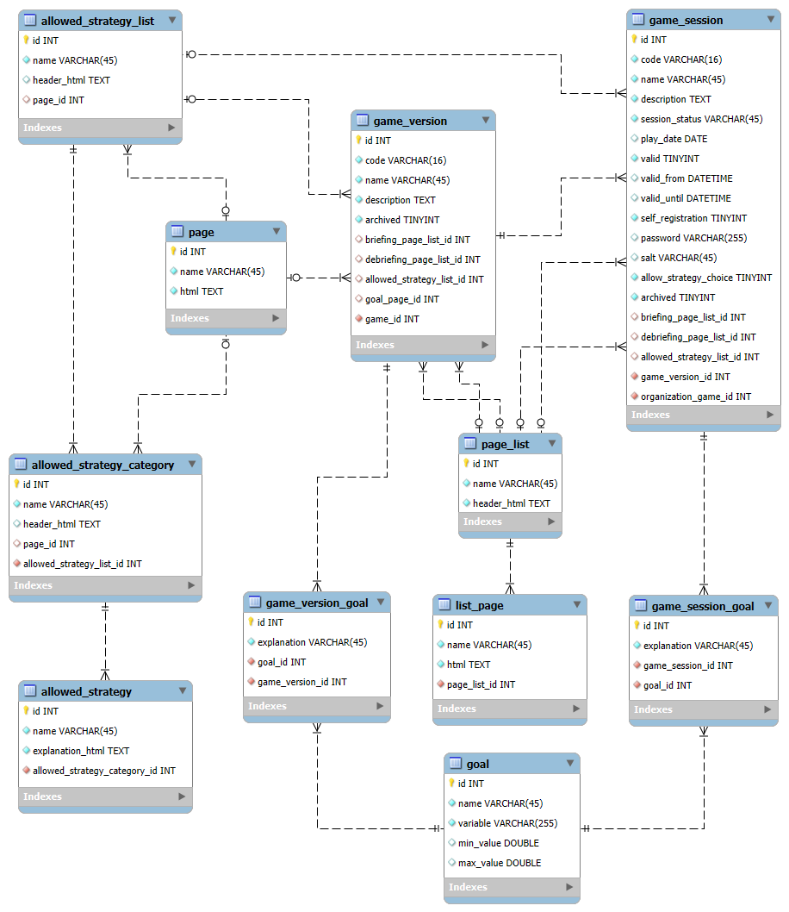
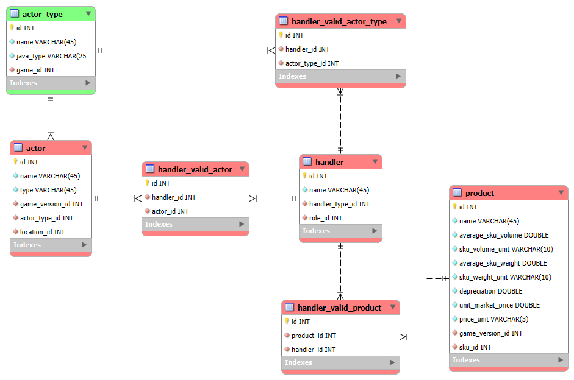
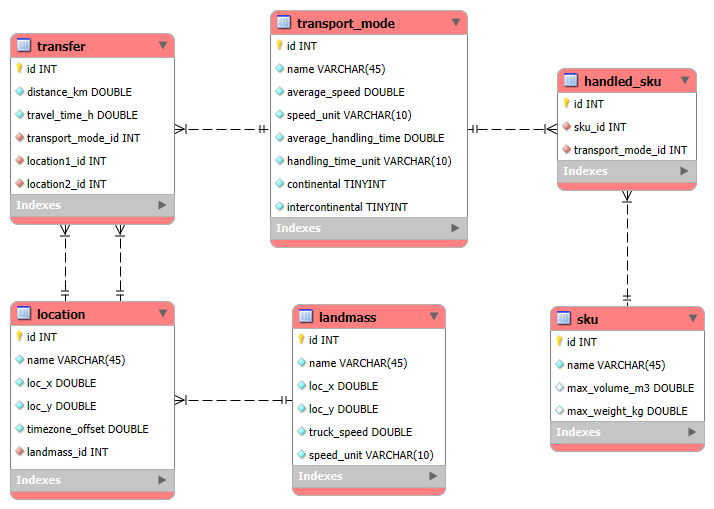
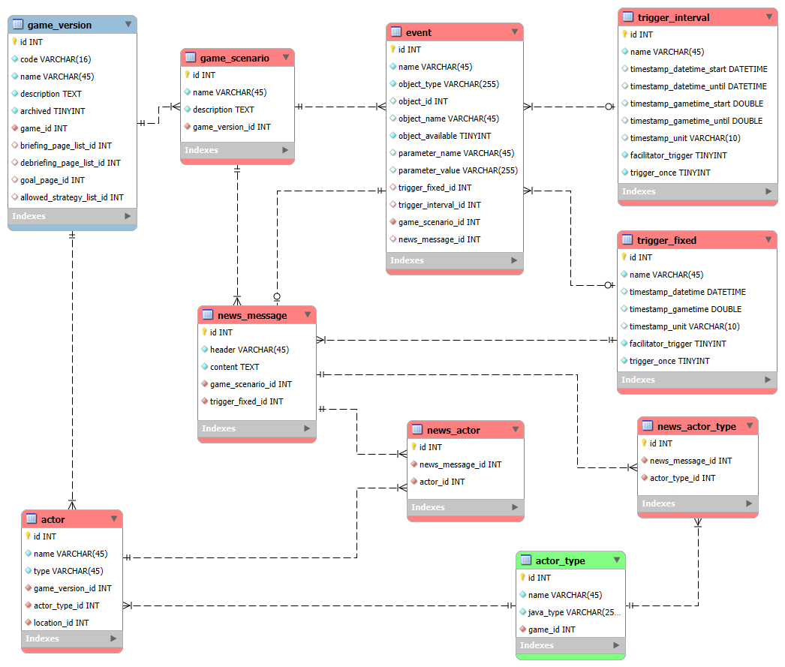
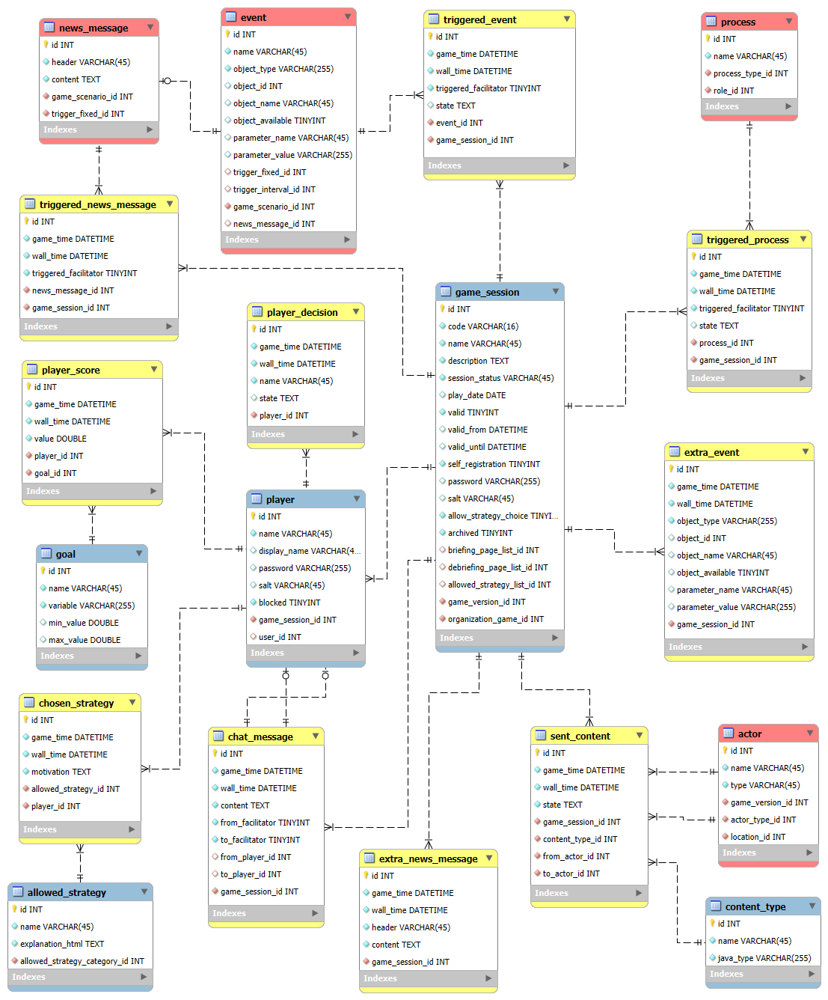

# 4.1. Database design

Last Updated: 2025-08-26

__Changelog:__
 - 2025-08-11 - Document creation
 - 2025-08-26 - Update with more detail about the data layers
 - 2025-08-26 - Made the terminology consistent with the architecture document
 - 2025-08-26 - Added main tables for GSCG Admin data
 - 2025-08-27 - Added design for GSCG Admin Data database tables
 - 2025-08-27 - Added design for Game Design Data database tables
 - 2025-08-28 - Added design choices for Game State and Game Play data
 - 2025-08-29 - Checked database design against the full set of requirements
 - 2025-08-29 - Enhance `content_receiver` class [Issue #18](https://github.com/averbraeck/gscg-design/issues/18).
 - 2025-08-29 - Add `timezone_offset` to the location [Issue #36](https://github.com/averbraeck/gscg-design/issues/36).
 - 2025-08-29 - Improve clarity of game terms in requirements [Issue #21](https://github.com/averbraeck/gscg-design/issues/21).
 - 2025-08-29 - Clarify `player` versus `user` in requirements [Issue #25](https://github.com/averbraeck/gscg-design/issues/25).
 - 2025-08-29 - Requirement added for debriefing by facilitator [Issue #28](https://github.com/averbraeck/gscg-design/issues/28).
 - 2025-08-29 - Add `organization_game_role` table to the database [Issue #24](https://github.com/averbraeck/gscg-design/issues/24).
 - 2025-08-30 - Re-allocate tasks between session admin and facilitator [Issue #24](https://github.com/averbraeck/gscg-design/issues/24).
 - 2025-08-30 - Make `edit` and `view` fields more descriptive [Issue #27](https://github.com/averbraeck/gscg-design/issues/27).
 - 2025-08-30 - Add self registration option for players in database [Issue #26](https://github.com/averbraeck/gscg-design/issues/26).
 - 2025-08-30 - Allow facilitator to set player self registration [Issue #26](https://github.com/averbraeck/gscg-design/issues/26).
 - 2025-08-30 - Enable blocking of player for a game session [Issue #29](https://github.com/averbraeck/gscg-design/issues/29).
 - 2025-08-30 - Table handler_valid_actor also on actor_type level [Issue #19](https://github.com/averbraeck/gscg-design/issues/19).
 - 2025-08-30 - Add database tables for briefing and debriefing [Issue #30](https://github.com/averbraeck/gscg-design/issues/30).
 - 2025-08-30 - Allow limits to be set on a trigger [Issue #33](https://github.com/averbraeck/gscg-design/issues/33).
 - 2025-08-30 - Specify goals for a game version [Issue #22](https://github.com/averbraeck/gscg-design/issues/22).
 - 2025-08-30 - Specify allowed strategies for a game version and session [Issue #23](https://github.com/averbraeck/gscg-design/issues/23).
 - 2025-08-30 - Store game play data [Issue #20](https://github.com/averbraeck/gscg-design/issues/20).
 - 2025-08-30 - Store chats in the database [Issue #35](https://github.com/averbraeck/gscg-design/issues/35).
 - 2025-08-30 - Add game play data for extra news items [Issue #31](https://github.com/averbraeck/gscg-design/issues/31).
 - 2025-08-30 - Add game play data for extra events [Issue #32](https://github.com/averbraeck/gscg-design/issues/32).
 - 2025-08-30 - Record triggered events in the database [Issue #34](https://github.com/averbraeck/gscg-design/issues/34).
 
 

## 4.1.1. High-level database design

The GSCG database is designed in three separate 'compartments' that are related, but managed by different roles:

1. **GSCG Admin data** with the organizations and users and their access rights.
2. **Game Design data** with the defined game instances with their actors, parameters, scenarios and player strategies.
3. **Game State data** with game sessions, game state, and game results

The results from the game can also be sent to the external data platform [gamedata.nl](https://gamedata.nl). In a sense, this defines a fourth data set:

4. **Game Play data** with game sessions, game state, and game results

## 4.1.2. GSCG Admin data

The GSCG Admin data supports the roles, use cases and requirements for the Portal Administrator, Organization Administrator, and Session Administrator. Important tasks are user administration, game administration, organization administration, and session administration. This leads to the following envisioned tables in the database:

- `organization` with the data for an organization that can define and play games.
- `user` with the data of someone who can log into one of the apps for GSCG. Note that a `player` is not necessarily a `user`, since they can be anonymous. A user can have a special characteristic `portal_admin` for portal administrators, who can create and delete instances of `organization` and a `game`, and can allocate the `game_role` for the game designer and `organization_role` for the organization administrator. Also the portal_admin is the only user who can make a `game` available to an `organization`.
- `organization_role` with the roles that a `user` can fulfill for the `organization`. One of the roles is to be the organization administrator, who can allocate roles to oher users for the organization.
- `game` as a placeholder for the definition of a game. `game` is related to the tables where the game designer role (a `user` with a `game_role`) can define and update one or more instances of `game_version`.
- `game_version` as a version of the game. Multiple versions with differences can exist. Game versions are not by definition tied to a specific `organization`, allowing games to be played by multiple organizations.
- `game_role` connecting a game designer (a `user`) to a `game`.
- `organization_game` defining that a particular `organization` has access to a `game`, so the `organization` can instantiate a `game_session`.
- `game_session` is a frozen link to a `game_version` that can be played on certain dates. It has allocated `players` and one or more game facilitators. A facilitator is a `user` with a certain role for that `game_session`.
- `organization_game_role` defines the instances of `user` who can act as session administrators.
- `game_session_role` defines the instances of `user` who can act as game facilitators.
- `player` contains the properties of self-registered game players, or game players generated by the game facilitator or session administrator. Since players can be anonymous, a `player` is not necessarily a persistent `user` in the database, but it can be.

The design of the GSCG Admin data tables looks as follows:

The goals and strategies have been defined in a separate diagram to keep the overview.
- `goal` is a variable with a minimum and/or maximum value that the player should try to reach in the game. Each goal contains a brief explanation for the player. `game_version` and `game_session` can have multiple instances of `goal`, e.g., profit and sustainability, each with their own thresholds that the player should try to reach. Goals from `game_session` override those of `game_version`.
- `game_version_goal` links a goal to a game version.
- `game_session_goal` links a goal to a game session.
- `allowed_strategy_list` containing a number of strategy categories.
- `allowed_strategy_category` containing a number of possible strategies to choose from.
- `allowed_strategy` explaining one strategy an a few lines.
- `page_list` as a list of pages with briefing or debriefing information. Both the `game_version` and the `game_session` can have a briefing and debriefing list of pages. The `game_session` definition overrides the `game_version` one.
- `list_page` is a html-formatted page belinging to a `page_list`.
- `page` is a standalone html page with an explanation. The page is used for explaining the allowed strategies the strategy category, and the goals of a game version. Note that all these pages are optional in the database definition.

The design of the GSCG Admin data tables for goals and strategies looks as follows:

## 4.1.3. Game design data

Game design data contains all data necessary to create and start a game. The database from the previous GSCG project was extremely complicated, with multiple layers defining software templates for actor definitions and their parameters on one layer, and the game definition and parameter values on another layer. This made the database complex, and instantiation slow. The database and the code to be executed do have a relation, of course. A database record (or set of records) defining an actor should contain the relevant properties for that actor as it is defined in the code. In that sense, the database 'mirrors' the simulation objects that have to be instantiated. The old database design was as follows:

Defining a game was a multi-month project due to the complexity of the database. In the design for this project, it might therefore be good to take a more lean approach, while keeping flexibility and maintainability. The tables for the game will be described in a number of steps below.

The overall diagram (with a couple or relations left out) is still complicated. Blue types refer to the Admin tables. Green tables define a game without values for the parameters. These tables set-up a rough scaffold for the game. Red tables define the details for the game, such as locations, distances, and values for the parameters of the actors, handlers, and autonomous processes.

Let's break down the database into several sub-components:

### Product tables

The product tables define the product, sku, and bill-of-materials:

- `product` gives the main characteristics of a product in the game or simulation. It specifies the name, the sock keping unit (`sku`), the average volume and weight (with units), the depreciation as a fraction per day, and a (starting / average) unit market price per `sku`.
- `sku` defines the way that the product is typically transported, such as on a pallet, in a 20 ft or 40 ft container, in a box, as a unit, etc. Each of the sku types has a maximum volume and weight, defining how many `product` instances fit in one `sku`.
- `bill_of_materials` defines the assembly of a `product` from semi-finished products or raw materials. The `bill_of_materials` uniquely belongs to a product and has multiple instances of a `bom_item`. Note that the `bill_of_materials` for a `product` van be `null`.
- `bom_item` is one product that is needed to assemble into another product, with the `amount` of `product` that is needed as one of its attributes.

The partial relations look as follows:

### Actor and Role tables

The actor table defines the organizations (agents) in the game with their location, whereas the role specifies the processing per type of decision that has to be made. The tables and relations look as follows:

- `actor_type` is a reference to an exisiting Java implementation of a type of actor in the simulation library. Therefore, it contains a reference to a `java_type`. The `actor_type` is defined on the game-level, since different instances of `game_version` can have a different set of defined actors.
- `actor` is the instantiation of an `actor_type` in the `game_version`. It has a `location` and one or more instances of `role`.
- `role_type` defines a role for an `actor_type` such as Purchasing, Selling, Producing, Banking or Transporting in the simulation library. Therefore, it contains a reference to a `java_type`.
- `role` is the instantiation of an `role_type` in the `game_version`. The `role` has a `content_receiver` that specifies when content (messages) can be received and how long it takes to process.
- `content_receiver` is a specification of the delay that occurs when receiving content (messages). It handles fixed delays, stochastic delays and working times of the actor (See Issue #18).
- `location` specifies an (x,y) or (lon,lat) position for the `actor`. It is located on a `landmass`. A location also has a timezone offset for global trade, see Issue #36.
- `landmass` is important, since trucks and trains cannot transport goods between landmasses, only on landmasses. For quick calculations on a landmass, the average truck speed is given for the landmass.

The partial relations look as follows:

### Actor and Role parameter/value tables

The actors and roles have parameters that need to be defined in the database. Every parameter has a type and a value for the game instance. The `actor_type`, `actor`, `role_type` and `role` have already been defined above. The tables and relations look as follows:

- `parameter_type` defines the java types that can be used, such as `int`, `double`, `DistContinuous`, `DistDiscrete`, `Speed`, `Length`, etc. Note that the definition is 'blue', which means that it is defined outside of the `game` or `game_version`. 
- `actor_parameter` belongs to an `actor_type` and indicates which parameters can or should be defined for an `actor` instance.
- `actor_value` provides the value of an `actor_parameter` for an `actor` instance.
- `role_parameter` belongs to a `role_type` and indicates which parameters can or should be defined for a `role` instance.
- `role_value` provides the value of a `role_parameter` for a `role` instance.

The partial relations look as follows:

### Handler and Process tables

The `handler` is the rule class for an actor that takes care of handling a certain `content_type`, such as an `Order`, a `RequestForQuote`, a `Payment` or a `Shipment`. A `process` is the definition of an autonomous process. The autonomous process in the simulation is not triggered by the receipt of a content message, such as the handler, but it acts autonomously, often based on a gien frequency. An example is a marker that buys products on a regular basis, or a Make-to-Stock producer of goods that makes its goods available to the market, irrespective of demand. The tables `role_type` and `role` have already been defined above.

- `parameter_type` defines the java types that can be used, such as `int`, `double`, `DistContinuous`, `DistDiscrete`, `Speed`, `Length`, etc. Note that the definition is 'blue', which means that it is defined outside of the `game` or `game_version`. 
- `handler_type` links to the definition of the handler in Java through the `java_type` field. It is linked to the `role_type` hat is defined on the level of a `game`.
- `handler` is a specific instantiation of the `handler_type` for a `role`, which is defined on the level of a `game_version`. 
- `content_type` is the type of message that the `handler` can handle in the simulation. Note that the definition is 'blue', which means that it is defined outside of the `game` or `game_version`. 
- `handler_parameter` belongs to a `handler_type` and indicates which parameters can or should be defined for a `handler` instance.
- `handler_value` provides the value of a `handler_parameter` for a `handler` instance.
- `process_type` links to the definition of the autonomous process in Java through the `java_type` field. It is linked to the `role_type` hat is defined on the level of a `game`.
- `process` is a specific instantiation of the `process_type` for a `role`, which is defined on the level of a `game_version`. 
- `process_parameter` belongs to a `process_type` and indicates which parameters can or should be defined for a `process` instance.
- `process_value` provides the value of a `process_parameter` for a `process` instance.

The partial relations look as follows:

Additionally, handlers can be restricted from which actors or actor types they process messages (e.g., take an order), and for which products they process messages (e.g., take an order):

### Transport tables

Transport modes and distances are provided in the transport tables. The `location` and `landmass` have already been defined above.

- `transport_mode` defines a transport mode, such as `Truck`, `Rail`, `Air` or `Ship`. Variants of these transport modes with different characteristics can of course also be defined.
- `handled_sku` indicates which type of packaging for products are handled by the `transport_mode`. A ship dies not take aircraft pallets, and an airplane cannot transport a 40 ft ISO container. The table links `sku` to `transport_mode` for the valid sku's that can be transported.
- `transfer` defines a link in the transport network. It indicates you can transport goods (products) from `location` A to `location` B with a certain `transport_mode`. An indication of the distance and travel time is provided as well. 

> [!TIP]
> Typically, the supply chain model will be set-up as a hub-and-spoke network. Actors are connected to the nearest hub per transport mode, such as ports, airports and rail terminals. Trucking on a landmass can be estimated using the `truck_speed` attribute in the `landmass` definition using a rough estimate of the distance between the two locations on the landmass.

### Scenario tables

In the game, events and news messages can be inserted at pre-defined times, random times, or facilitator-triggered times. Events can relate to actors, roles, handlers, autonomous processes, transport links, or any other variable in the simulation or game. Therefore, no explicit links to tables in the database are made for now, since the events can relate to many of the tables in the database. `game_version`, `actor_type` and `actor` have already been defined before.

- `game_scenario` defines a scenario for a `game_version`. Note that a `game_version` can have multiple instances of a `game_scenario`. The facilitator can activate one scenario at a time for game play. In a `game_scenario`, events and news messages can be defined.
- `event` is a table that can activate or deactivate a game object, such as an actor or a transport mode. To identify the object, the type is given as well as the database id or the object name. The event can be triggered at a time, time interval, or based on facilitator input. An `event` *can* have an associated `news_message` that will be fired exactly when the event is triggered.
- `trigger_fixed` is a trigger at a fixed point in time. When the game clock is a `datetime`, this can be specified. When the gametime is a `double` or a `Duration`, this can be specified as well, including the unit. When `facilitator_trigger` equals 1, the facilitator can trigger the event as well. When all timestamp fields are `null`, and `facilitator_trigger` equals 1, the event can *only* be triggered by the facilitator. 
- `trigger_interval` is a trigger that will be fired on a uniform interval between two timestamps. The timestamps can either be expressed as a a `datetime`, or as a `double` or a `Duration`, including the unit. The `trigger_interval` can also be triggered by the facilitator, analogous to the `trigger_fixed`. 
- `news_message` is a communication to the players. A `news_message` can either be triggered at a fixed time, or it is associated with an `event`. The players to whom the `news_message` will be sent can be restricted by the `news_actor` and `news_actor_type` tables. When both are blank, the `news_message` is sent to all players.
- `news_actor` specifies to which actor instances a `news_message` is sent.
- `news_actor_type` specifies to which actor types a `news_message` is sent.

## 4.1.4. Game state data

Several solutions exist for the storage of game state data:

1. Storing all *transactions*. The advantage of this approach is that it is very easy. Transactions are triggered by the messages (content) sent between supply chain actors. Additional transactions are player input and facilitator input. Given known seeds of the random number generators, the game is fully reproducible with this information. Theoretically, storing the messages is not even necessary, since they are either triggered by a previous message, or by (predictable) agent behavior or by player or facilitator input. The disadvantage is that for restoring the state of the game, the entire game has to be replayed from t=0.
2. Saving the *entire state* of the game regularly, e.g., once per play day or week. The advantage of this approach is that it allows for a quick restore. The disadvantage is that tracing the progress of the game for analysis purposes is much harder, although that is actually the task of the Game Play data for analytics. Another disadvantage is that the latest player decisions are lost.
3. *Combining* a regular state save with the transactions since the last state save. The advantage is that it is complete and can do a quick full restore. The disadvantage is that two mechanisms have to be implemented.

For now, transactions are stored, since they are needed anyhow for the game analytics platform and to show game state to the facilitator and players. In addition, regular state saves of the game for rapid retrieval can be done as well. 

A first set of tables to store the most important information per player has been created. All tables have a `game_time` field, and a `wall_time` field, storing the game time in UTC and the wall clock time of the game play record.

- `player_decision` stores input from players to the live game session. The `state` field can be a copy of the json data sent from the player's browser, to easily replicate and analyze it later.
- `chosen_strategy` stores the strategy that the player has chosen, for each `strategy_category`. Note that the player could change the strategy at some time during the game, if allowed by the facilitator. Strategies an be chosen by players as long as the field `allow_strategy_choice` in `game_session` is true.
- `sent_content` stores every content message that was sent between actors in the game into the database.
- `chat_message` stores chats between players and between a facilitator and a player into the database.
- `triggered_event` stores the timestamp and state of an event that was triggered automatically (`triggered_facilitator` is false) or by the facilitator (`triggered_facilitator` is true). The state information of the event, if applicable, can be stored as well.
- `triggered_process` stores the timestamp and state of an autonomous process that was triggered automatically. The state information of the process execution, if applicable, can be stored as well.
- `triggered_news_message` stores the timestamp of a news message that was released automatically (`triggered_facilitator` is false) or released by the facilitator (`triggered_facilitator` is true). 
- `extra_event` stores the timestamp and state of a new event that was injected by the facilitator during game play.
- `extra_news_message` stores the timestamp of a news message that was injected by the facilitator during game play.
- `player_score` updates the changes in the variables that are defined in the `game_version_goal` or `game_session_goal`. To this end, the `player_score` table is linked to `goal`. 

The game play tables are indicated by a yellow banner.

## 4.1.5 Game play data for analysis

The game play data that is sent to the data analysis platform (scores, play information for analysis) does not need any extra information in the database. The database for game analytics has already been set-up and mirrors the Admin data for GSCG as defined above: see [gamedata documentation](https://github.com/averbraeck/gamedata-common/blob/main/docs) for more info. The database is defined as follows:

The structure with tables for `organization`, `user`, `game`, `game_version`, `game_session` and `player` plus linking tables to define the access of different users is very similar to the set-up of the Admin data for GSCG.

No additional data has to be stored for game play right now, in case the game play information is sent to the gamedata platform. In case we want to store this information locally in the GSCG database, several of the tables from the gamedata database can be copied into the GSCG database.

## 4.1.6. Checking against requirements

Below, all requirements of GSCG are checked against the availability of the data to support that requirement.

### 4.1.6.1. Portal administration.

- General: the `user` table has a field `portal_admin` that defines the portal administrator.
- FC1.1 The portal administrator must be able to change their own password to enter the GSCG portal
   The `user.password` field is in the database.
- FC1.2 The portal administrator must be able to create a user
   The `user` table is in the database.
- FC1.3 The portal administrator must be able to delete a user
   The `user` table is in the database.
- FC1.4 The portal administrator must be able to reset the password of a user
   The `user.password` field is in the database.
- FC1.5 The portal administrator must be able to change the access rights of a user (* see below)
   The `organization_role`, `game_role`, `organization_game_role` and `game_session_role` tables in the database define the access rights of a user.
- FC1.6 The portal administrator must be able to create a new game
   The `game` table is in the database.
- FC1.7 The portal administrator must be able to delete a game that has no game versions
   The `game` table is in the database. The foreign key to `game_version` prevents deletion of an active game.
- FC1.8 The portal administrator must be able to allocate a user to be the game administrator for a game
   The `game_role` table with the boolean `admin` field makes a user a game administrator.
- FC1.9 The portal administrator must be able to create an organization
   The `organization` table is in the database.
- FC1.10 The portal administrator must be able to delete an organization (or to disallow access for users of the organization)
   The `organization` table is in the database. User access is provided by the `organization_role` table.
   **Note:** a field `archived` or `inactive` could be added to the `organization`, `user` and `organization_role` to indicate it cannot be used right now.
- FC1.11 The portal administrator must be able to allocate a user to be the administrator of an organization
   The `admin` field in `organization_role` codes organization administration.
- FC1.12 The portal administrator must be able to login to the portal
   No consequences for database.
- FC1.13 The portal administrator must be able to logout from the portal
   No consequences for database.

The non-functional requirements have no effect on the database.

(*) Details for access rights from the requirements:

Note for FC1.5: The access rights for a user are:
- portal-administrator
   The `user` table has a field `portal_admin` that defines the portal administrator.
- organization administrator, with a link to one or more organizations
   A true value for the `admin` field in `organization_role` codes organization administration.
- organization member, with a link to one or more organizations
   A false value for the `admin` field in `organization_role` codes organization access for a `user`.
- game designer, with a link to one or more games
   A true value for the `admin` field in `game_role` codes game admin access for a `user`.
- game member, with a link to one or more games
   A false value for the `admin` field in `game_role` codes game view access for a `user`.
- session administrator, with a link to one or more game games for the organization
   A true value for the `admin` field in `organization_game_role` codes game session admin access for a `user`.
- session facilitator, with a link to one or more game sessions
   A true value for the `facilitator` field in `game_session_role` codes game facilitator access for a `user`.
- session observer, with a link to one or more game sessions
   A false value for the `facilitator` field in `game_session_role` codes game observer access for a `user`.
- game player, with a link to one or more game sessions
   The `game_session_id` field in `player` codes game session access for a `player`.

### 4.1.6.2. Game design.

- General: the `game_role` table with the boolean `admin` field set to true makes a `user` a game administrator.
- FC2.1 The game designer must be able to change their own password to enter the GSCG portal
   The `user.password` field is in the database.
- FC2.2 The game designer must be able to create a game version
   The `game_version` table is in the database.
- FC2.3 The game designer must be able to clone a game version
   The `game_version` table is in the database.
- FC2.4 The game designer must be able to choose a game version to maintain
   The `game_version` table is in the database.
- FC2.5 The game designer must be able to set the player goals for the chosen game version
   Player goals are contained in the tabled `goal_list` and `goal`, linked to a `game_version`.
- FC2.6 The game designer must be able to set the actors to use for the chosen game version
   The database contains `actor_type` and `actor` with `role_type` and `role`.
- FC2.7 The game designer must be able to set the scenario to use for the chosen game version
   The database has a table `game_scenario`.
- FC2.8 The game designer must be able to set the parameters for an actor in the chosen game version
   The tables `actor` and `role` have configurable parameters and values.
- FC2.9 The game designer must be able to set the parameters for a scenario in the chosen game version
   The table `game_scenario` has events and triggers, as well as news messages in separate tables.
- FO2.10 The game design should present one or more screens that provide an overview of the defined actors with their capabilities
   No effect on database.
- FO2.11 The game design should present a timeline with the scenario events for the game version
   The `trigger` tables with timestamps for a `game_scenario` help to present a timeline.
- FO2.12 The game design should present a map with the actors displayed at their locations
   Actors have a `location` in the database with lat/lon.
- FC2.13 The game designer must be able to login to the portal
   No consequences for database.
- FC2.14 The game designer must be able to logout from the portal
   No consequences for database.
- FC2.15 The game designer must be able to set allowable strategies that can be chosen by the players
   The `game_version` has an `allowed_strategy_list` with allowed strategies, clustered into a number of categories.

The non-functional requirements have no effect on the database.

### 4.1.6.3. Organization administration.

- General: the `organization_role` table with the boolean `admin` field makes a `user` an organization administrator.
- FC3.1 The organization administrator must be able to change their own password to enter the GSCG portal
   The `user.password` field is in the database.
- FC3.2 The organization administrator must be able to create a user
   The `user` table is in the database.
- FC3.3 The organization administrator must be able to delete a user
   The `user` table is in the database.
- FC3.4 The organization administrator must be able to reset the password of a user
   The `user.password` field is in the database.
- FC3.5 The organization administrator must be able to change the access rights of a user
   The `organization_role` table in the database define the access rights of a user.
- FC3.6 The organization administrator must be able to change the description of the organization
   The `organization` table has a field `name`.
- FC3.7 The organization administrator must be able to change the logo of the organization
   The `organization` table has a field `logo` (binary blob).
- FC3.8 The organization administrator must be able to allocate existing platform users to the organization
   The `organization_role` table in the database links a `user` to an `organization`.
- FO3.9 The organization administration should present an overview of the games in use
   The `organization_game` table contains the games in use by the `organization`.
- FO3.10 The organization administration should present an overview of the defined game sessions
   The `game_session` table is uniquely linked to an `organization_game` and can therefore be used to provide a list of game sessions only for that `organization`.
- FO3.11 The organization administration should present an overview of the users allocated to the organization
   The `organization_role` table provides all users linked to the `organization`.
- FC3.12 The organization administrator must be able to login to the portal
   No consequences for database.
- FC3.13 The organization administrator must be able to logout from the portal
   No consequences for database.

The non-functional requirements have no effect on the database.

### 4.1.6.4. Session administration.

- General: the `organization_game_role` table with the boolean `admin` field set to true emakes a `user` a session administrator.
- FC4.1 The session administrator must be able to change their own password to enter the GSCG portal
   The `user.password` field is in the database.
- FC4.2 The session administrator must be able to create a user
   The `user` table is in the database.
- FC4.3 The session administrator must be able to delete a user
   The `user` table is in the database.
- FC4.4 The session administrator must be able to reset the password of a user
   The `user.password` field is in the database.
- FC4.5 The session administrator must be able to change the access rights of a user
   The `game_session_role` tables in the database define the access rights of a user.
- FC4.6 The organization administrator for a game must be able to create a game session
   The table `organization_game_role` defines users who can create game sessions, and appoint the session administrator, after which the session administrator can fill in the further details. 
- FC4.7 The session administrator must be able to change the dates of a game session
   A `game_session` has fields `play_date`, `valid_from` and `valid_until` (all `DATETIME` fields).
- FC4.8 The session administrator must be able to delete a game session that has not yet been played
   A session administrator has access to the session through the table `game_session_role`.
- FC4.9 The session administrator must be able to allocate players to a game session
   Players can be allocated to a game session: A `player` has a `game_session_id`.
- FC4.10 The session administrator must be able to turn player self registration for a game session on or off.
   The boolean field `self_registration` in `game_session` can turn self registration on or off.
- FC4.11 The session administrator must be able to generate a batch of anonymous players with login codes and passwords
   The table `player` has a `name` and `password` field (with `salt`).
- FO4.12 The session administration should present an overview of the sessions with dates and play status
   Not easy right now. See NOTE.
- FO4.13 The session administration should present an overview of the facilitators and players allocated to a session
   Players are linked to a game session and can be easily enumerated. Facilitators are users that have a `game_session_role` with the field `facilitator` set to true.
- FC4.14 The session administrator must be able to login to the portal
   No consequences for database.
- FC4.15 The session administrator must be able to logout from the portal
   No consequences for database.
- FC4.16 The session administrator must be able to set or change the allowable strategies that can be chosen by the players
   The `game_session` has an `allowed_strategy_list` with allowed strategies, clustered into a number of categories.

The non-functional requirements have no effect on the database.

### 4.1.6.5. Session facilitation

- General: the `game_session_role` table with the boolean `facilitator` field set to true makes a `user` a session facilitator.
- FC5.1 The facilitator must be able to change their own password to enter the GSCG portal
   The `user.password` field is in the database.
- FC5.2 The facilitator must be able to create a player for the game session
   The facilitator has access to the `game_session` with attached `player` records.
- FC5.3 The facilitator must be able to delete a player for the game session
   The facilitator has access to the `game_session` with attached `player` records.
- FC5.4 The facilitator must be able to reset the password of a player allocated to the game session
   The facilitator has access to the `game_session` with attached `player` records. Each `player` record has a `password` field (with a `salt`).
- FC5.5 The facilitator must be able to change the access of a player to the game session
   The field `blocked` for player (default false) can block a player from playing.
- FC5.6 The facilitator must be able to allocate an existing user to the game session
   A `player` can be linked to a `user` in the database through a nullable field `user_id`.
- FC5.7 The facilitator must be able to deallocate an existing user from the game session
   A `user` can be unlinked from a `game_session` by deleting the `player` record.
- FO5.8 The facilitator should provide a briefing of the game to the players
   The field `briefing_page_list_id` in `game_version` and `game_session` (for an override) link to a `page_list` with multiple `page` records for the briefing.
- FC5.9 The facilitator must be able to start the game session
   No consequence for database.
- FC5.10 The event of starting the game session must be sent to the gamedata platform
   No consequences for database.
- FC5.11 The facilitator must be able to change the game speed
   No consequence for database.
- FC5.12 The facilitator must be able to pause the game
   No consequence for database.
- FO5.13 The facilitator should be able to insert an extra news item for the players
   The table `extra_news_message` stores news messages that have been injected by the facilitator into the game play.
- FC5.14 The event of adding a news item to the the game session must be sent to the gamedata platform
   No consequences for database.
- FO5.15 The facilitator should be able to add an intervention into the game
   The table `extra_event` stores events that have been injected by the facilitator into the game play.
- FC5.16 The event of adding an intervention to the the game session must be sent to the gamedata platform
   No consequences for database.
- FO5.17 The facilitator should be able to trigger an existing manual intervention during gameplay
   The `trigger_interval` and `trigger_fixed` tables have a boolean field called `facilitator_trigger`. If true, the facilitator can trigger the event. The fact that an event has been triggered is stored into the `triggered_event` table.
- FC5.18 The event of triggering an existing intervention during the the game play must be sent to the gamedata platform
   No consequences for database.
- FO5.19 The session facilitation should present an overview of the players allocated to a session
   Players are linked to a game session and can be easily enumerated.
- FO5.20 The session facilitation should present a map with the actors displayed at their locations
   All `actor` instances have a `location` with lat,lon or x,y.
- FO5.21 The session facilitation should allow chatting with the active players in the game session
   The table `chat_message` stores chats between players and between a facilitator and a player into the database.
- FC5.22 The facilitator must be able to login to the portal
   No consequences for database.
- FC5.23 The facilitator must be able to logout from the portal
   No consequences for database.
- FO5.24 The facilitator should provide a debriefing of the game to the players
   The field `debriefing_page_list_id` in `game_version` and `game_session` (for an override) link to a `page_list` with multiple `page` records for the debriefing.
- FC5.25 The facilitator must be able to change the dates of a game session
   A `game_session` has fields `play_date`, `valid_from` and `valid_until` (all `DATETIME` fields).
- FC5.26 The facilitator must be able to generate a batch of anonymous players with login codes and passwords
   The table `player` has a `name` and `password` field (with `salt`).
- FC5.27 The facilitator must be able to set or change the allowable strategies that can be chosen by the players
   The `game_session` has an `allowed_strategy_list` with allowed strategies, clustered into a number of categories.
- FC5.28 The facilitator must be able to turn player self registration for a game session on or off.
   The boolean field `self_registration` in `game_session` can turn self registration on or off.

The non-functional requirements have no effect on the database.

### 4.1.6.6. Game play

- FC6.1 The player must be able to create a userid/password for the game session in case the game allows self-registration
   The `player.name` and `player.password` fields are in the database.
- FC6.2 The player must be able to change their password
   The `player.password` field is in the database.
- FC6.3 The player must be able to login to the game session with a userid and password
   The `player.name` and `player.password` fields are in the database.
- FO6.4 The game play platform should show the briefing (note that the game might take place in a distributed setting)
   The field `briefing_page_list_id` in `game_version` and `game_session` (for an override) link to a `page_list` with multiple `page` records for the briefing.
- FC6.5 The game play platform must show dynamic state information about the player's firm during game play
   The table `player_decision` and `player_score` contain information about the player's firm. 
- FC6.6 The game play platform must show the news at the correct times during game play
   Each `news_message` has a `trigger_fixed` record attached to it, defining when the news item should be displayed to the player.
- FC6.7 The player must be able to enter decisions into the game play platform during game play
   The table `player_decision` stores decision information in the database.
- FC6.8 The game play platform must send player decisions to the gamedata platform
   No consequences for database.
- FC6.9 The game play platform must show the scores to the player during and after game play
   The table `player_score` stores the scores of the player, related to a `goal`. 
- FO6.10 The game play platform should show the debriefing (note that the game might take place in a distributed setting)
   The field `debriefing_page_list_id` in `game_version` and `game_session` (for an override) link to a `page_list` with multiple `page` records for the debriefing.
- FC6.11 The player must be able to logout from the game session
   No consequences for database.
- FO6.12 The game play platform should show a map with the actors displayed at their locations, highlighting the player
   All `actor` instances have a `location` with lat,lon or x,y.
- FO6.13 The game play platform should allow chatting with other players in the game session and with the facilitator
   The table `chat_message` stores chats between players and between a facilitator and a player into the database.
- FC6.14 The player must be able to define a strategy, dependent on the settings in the game
   The player's chosen strategy is defined in the table `chosen_strategy`, which links to an `allowed_strategy`.
- FC6.15 The player must be able to motivate their chosen strategy
   The table `chosen_strategy` contains a `motivation` field. 
- FC6.16 The game play platform must send the strategy and the motivation of the player to the gamedata platform
   No consequences for database.

The non-functional requirements have no effect on the database.

### 4.1.6.7. Game data analytics

The functions for game data analytics might be provided by the gamedata.nl platform.

- FC7.1 The data analyst must be able to login to the game data platform
   The gamedata platform has users with passwords for login.
- FC7.2 The data analyst must be able to change their password
   The gamedata platform allows users to change their password.
- FC7.3 The data analyst must be able to logout from the game data platform
   The gamedata platform allows users to logout.
- FC7.4 The data analyst must be able to choose a game to analyze or export
   The gamedata platform allows users with the right access to access and export a game session with data.
- FC7.5 The game data platform must show the session and facilitator events for a game session to the data analyst
   If session and facilitator events are sent to the gamedata platform, users can see and analyse them.
- FC7.6 The game data platform must show the player events for a game session to the data analyst
   If player events are sent to the gamedata platform, users can see and analyse them.
- FC7.7 The game data platform must show the player scores for a game session to the data analyst
   If player scores are sent to the gamedata platform, users can see and analyse them.
- FC7.8 The game data platform must show the log data for a game session to the data analyst
   If log data is sent to the gamedata platform, users can see and analyse them.
- FC7.9 The game data platform must show the errors for a game session to the data analyst
   If errors are sent to the gamedata platform, users can see and analyse them.
- FC7.10 The game data platform must export the session and facilitator events for a game session to a file
   The gamedata platform has an export function to csv for all data tables.
- FC7.11 The game data platform must export the player events for a game session to a file
   The gamedata platform has an export function to csv for all data tables.
- FC7.12 The game data platform must export the player scores for a game session to a file
   The gamedata platform has an export function to csv for all data tables.
- FC7.13 The game data platform must export the log data for a game session to a file
   The gamedata platform has an export function to csv for all data tables.
- FC7.14 The game data platform must export the errors for a game session to a file
   The gamedata platform has an export function to csv for all data tables.

The non-functional requirements have no effect on the database.
