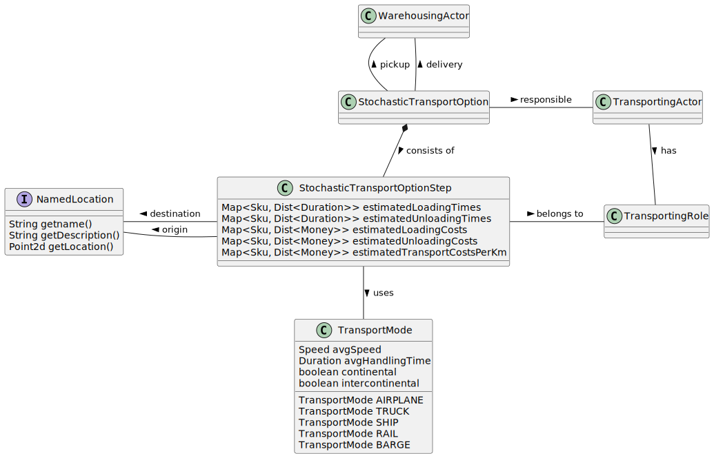

# 5.2. Class design of the simulation model

Last Updated: 2025-09-18

__Changelog:__
 - 2025-09-20 - Document Creation
 

## 5.2.1. Actor and Role: exchanging information and products

The `Actor` with one or more `Role` instances is at the heart of the design. The `Actor` represents a (department in a) supply chain organization that is responsible to process certain information and/or products. The processing of information and/or products is done by a so-called `ContentHandler`. Roles only have handlers for the tasks they are supposed to do. So a `FinancingRole` has a `ContentHandler` for an `Invoice`, whereas a `SellingRole` has a `ContentHandler` for an `Order`. The actors, roles, and content handlers enable a fine-grained set of responses for information coming in, where each handler typically consists of only a few lines of code that determine whether to react on the incoming content, how to react, and when to react. Reactions are always implemented by sending new content -- sometimes to the sender of the original request, sometimes to another actor or role. A `Role` can also start autonomous processes at regular intervals, e.g., to check on inventory or to purchase goods.

The relation between these important objects is as follows:

For each type of `Content`, a different `record` is used. Each content record minimally contains the `sender`, `receiver` and a `timestamp`. The content types have been described in the [function design](function-design.md).

## 5.2.2. Product and Shipment

In the end, a supply chain model is all about sending and receiving a certain amount of a product. Products are packaged and sent based on their stock-keeping unit or SKU. SKU's are, for instance, a pallet, a box, a single item, a truckload, or a container. Some SKU's are weight constrained, some are volume constrained. When products can be assembled by one of the actors from smaller units, the product has a Bill of Materials. 

A `Shipment` is an amount of product that is delivered by a transporter from Actor A to Actor B. Note that the location of pickup and delivery (of class `NamedLocation`), which are actual warehouses, might be different from the location of the `WarehousingActor`, which is the office. Typically, these locations will be the same, but flexibility has already been built in to allow the location of the physical warehouse to be different from the location of the actor's office.

## 5.2.3. Warehousing: storing products

The `Inventory` of a warehouse is stored in the `WarehousingRole`. It contains records for a `Product` with an amount. For the MRP functionality, ordered amounts and reserved amounts are also included. With this information, one can see whether there is an expected shortage of product in the future or not. An `AutonomousProcess` for restocking observes the `Inventory` at regular intervals, and decides to order new products for the inventory or not. It does so by creating a `Demand` message. Several restocking policies exist, of which two have been depicted in the class diagram. ordering fixed amounts, and working with a safety stock.

## 5.2.4. Storing content, the 'ERP' system of an Actor

Each `Actor` has a repository for storing trade messages, both the messages it received and the messages it sent. This repository can help to retrieve the original order or order confirmation for a shipment when the shipment is received: was the delivery as ordered or confirmed? The same for when an invoice is received: is the invoiced amount correct? 

The `groupingId` plays an important role: all messages belonging to the same order or demand request, can be grouped together. In the `ContentStore`, a distinction is also made between sent and received content. The boolean `sent` parameter in the below class diagrams indicates whether information is sent or received by this actor.

Several implementations of a `ContentStore` exist. The `ContentStoreEmpty` does not store any data. For some actors, storing any data is not necessary. An example is the `BankActor` in the game. It processes transactions, but does not need to keep all of them for the supply chain game's purpose. The `ContentStoreFull` keeps all messages until they are removed with one of the `remove` methods.

## 5.2.5. Transport

Transport is modeled by a special set of actors in the game, the `TransportingActor`. Each actor can transport certain types of goods (depending on the SKU) using a certain mode of transport (the `TransportMode`). 

A `TransportPreference` specifies how an `Actor` would like the `Shipment` to be transported. It contains a list of preferred `TransportMode`s and a relative preference for either cost, time, or distance. Note that each `TransportMode` might or might not do continental or intercontinental transport, and that each TransportMode can handle a limited number of SKUs.

A `TransportOption` is a door-to-door transport solution for transporting goods from the origin (warehouse) to the destination (warehouse). A `TransportOption` consists of `TransportStep` parts: E.g., trucking the goods from Warehouse to the nearest deep-sea Port, deep-sea transportation from origin Port to Destination Port, and then trucking to the receiver of the goods.

There is also a variant with a `StochasticTransportOptionStep` for the `StochasticTransportOption`, which contains estimates for the time and costs of loading and unloading of an SKU, and an estimated speed of transport.

## 5.2.6. Manufacturing

> [!NOTE]
> TODO.

