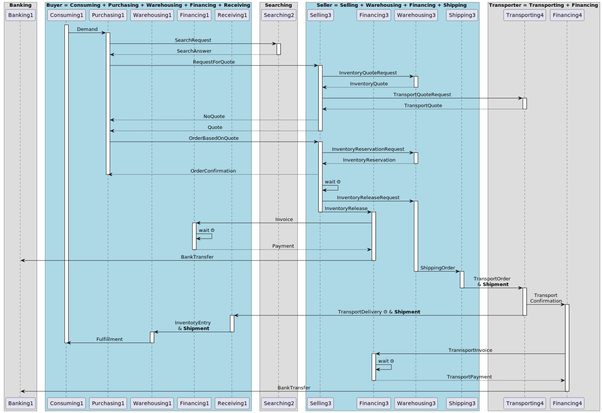

# 5.1 Function and Service Design

The inner working of the simulation model is based on a simplified diagram of messages between actors in the supply chain simulation. The model has its roots in SCOR, and in the research by Van Houten (2007) and Van Krevelen (2011). 

## 5.1.1. Actors in the simulation

In total, we see the following Actor Types (each fulfilling multiple roles):
- **Seller**: provides products or components to any other Actor.
- **Manufacturer**: provides added value operation on components to create products, e.g. by assembly.
- **Distributor**: has multiple warehouses to store products for a  local market; sources these goods, and redistributes them between different warehouses; carries out rework for quality where necessary; negotiates orders with Buyers, and arranges the transport to these buyers.
- **Buyer**: sources products with a certain frequencies, volumes, and request for quality.
- **Transporter**: arranges transport between different Actors, can use different modes of transport with a different speed, cost, and environmental impact.
- **Banker**: maintains the bank accounts; transfers money between Actors; provides loans to Actors for a certain interest percentage; pays interest when there’s money in the bank.
- **Searcher**: maintains information about all the companies in the simulation, can provide a list of Actors based on a search profile.

## 5.1.2. Roles in the simulation

We assume the following roles to be present in the actors to carry out the work:
- Banking Role (handles money transfer betrween actors and provides loans)
- Consuming Role (handles the purchases and stays in contact with the Sellers)
- Financing Role (handles sending of invoices and paying of invoices)
- Purchasing Role (keeps track of price developments on the supplier side)
- Receiving Role (receives shipments from suppliers, and assesses quality before the shipment is put into inventory)
- Searching Role (maintains information about actors; handles search for actors given a profile)
- Selling Role (handles the sales and stays in contact with the customers)
- Shipping Role (ships an order from a Warehouse to a Buyer or other Warehouse)
- Transporting Role (arranges transport between warehouses and customers)
- Warehousing Role (guards the inventory and places internal orders for safety stock)

Right now, we assume that each role keeps its own information, and its own statistics / world model of the environment. It could be, though, that separate roles will take care of this. 

## 5.1.3. Sequence diagram with messages

The sequence diagram of messages between Roles in the simulation model looks as follows:

