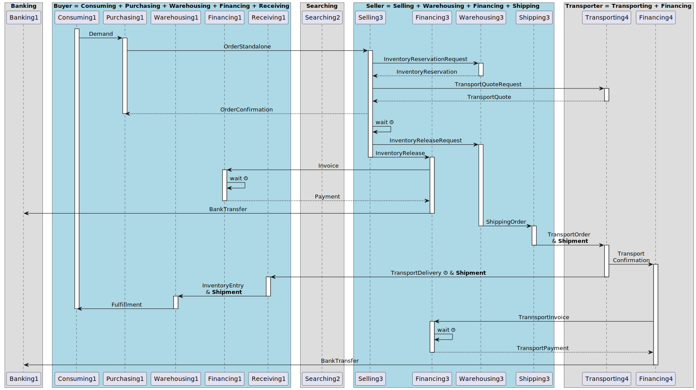

# 5.1 Simulation Model Design

Last Updated: 2025-09-18

__Changelog:__
 - 2025-09-16 - Document Creation
 - 2025-09-20 - Update with manufacturing and warehousing strategies
 

The inner working of the simulation model is based on a simplified diagram of messages between actors in the supply chain simulation. The model has its roots in SCOR, and in the research by Van Houten (2007) and Van Krevelen (2011). 

## 5.1.1. Actors in the simulation

In total, we see the following Actor Types (each fulfilling multiple roles):
- **Seller**: provides products or components to any other Actor. A Supplier is a special type of Seller.
- **Manufacturer**: provides added value operation on components to create products, e.g. by assembly.
- **Distributor**: has one or more warehouses to store products for a  local market; sources these goods, and redistributes them between different warehouses; negotiates orders with bBuyers, and arranges the transport to these buyers.
- **Buyer**: sources products with a certain frequencies, volumes, and request for quality. A Customer or Retailer is a special type of Buyer.
- **Transporter**: arranges transport between different Actors, can use different modes of transport with a different speed, cost, and environmental impact.
- **Banker**: maintains the bank accounts; transfers money between Actors; provides loans to Actors for a certain interest percentage; pays interest when there’s money in the bank.
- **Searcher**: maintains information about all the companies in the simulation, can provide a list of Actors based on a search profile.

## 5.1.2. Roles in the simulation

We assume the following roles to be present in the actors to carry out the work:
- **Banking Role** (handles money transfer between actors and provides loans)
- **Consuming Role** (handles the purchases and stays in contact with the sellers)
- **Directing Role** (high-level decisions about product-market combinations or services offered)
- **Financing Role** (handles sending of invoices and paying of invoices)
- **Manufacturing Role** (transforms products according to a Bill of Materials)
- **Purchasing Role** (keeps track of price developments and offers from sellers)
- **Receiving Role** (receives shipments from suppliers, and assesses quality before the shipment is put into inventory)
- **Searching Role** (maintains information about actors; handles search for actors given a profile)
- **Selling Role** (handles the sales and stays in contact with the customers)
- **Shipping Role** (ships an order from a warehouse to a buyer or other warehouse)
- **Transporting Role** (moves shipments between sellers, warehouses and buyers)
- **Warehousing Role** (guards the inventory and places internal orders for safety stock)

Right now, we assume that each role keeps its own information, and its own statistics / world model of the environment. It could be, though, that separate roles will take care of this. 

## 5.1.3. Sequence diagrams with messages for buying and selling

The sequence diagram of messages between Roles in the simulation model for a transaction between a buyer and a seller, based on a Request for Quote (RFQ) looks as follows. The workflow starts with a Seller receiving an RFQ (Request for Quote) from a Buyer. The RFQ is sent by the Purchase Role in the Buyer Actor. The Selling Role in the Seller handles the RFQ, and goes through an extended process with many dead-ends to potentially answer the RFQ with one or more Quotes. This means that not every RFQ receives a Quote as an answer. Transport for the Shipment is also arranged, and both the Transporter and the Seller are paid. 

A second possibility to buy and sell is based on a direct order. The Buyer knows exactly from which Seller the product has to be bought. Instead of an OrderBasedOnQuote, the Buyer sends an OrderStandalone. Usually, pricing is based on a fixed price agreement or a publicly available price table (Note: this still has to be implemented). The sequence of activities and messages is a bit different, but except for the search and the quoting, almost all messages are similar.

## 5.1.4. Manufacturing and warehousing strategies

Each `Actor` needs to decide what products to keep in inventory as a final product to be sold, and what products to acquire (either through manufacturing or through purchasing) once an order comes in. For manufacturing and warehousing, the following strategies exist and are used in the game:

| **Strategy Type**         | **Manufacturing Term** | **Warehouse / Procurement Term** | **Meaning** |
|---------------------------|------------------------|----------------------------------|-------------|
| Forecast-based / stocked  | **MTS** – Make to Stock | **STF** – Stock to Forecast (or *Stocked Item*) | Goods are produced or procured in advance and kept on hand, based on demand forecast or service-level target. |
| Order-based / non-stocked | **MTO** – Make to Order | **PTO / BTO** – Procure to Order / Buy to Order (or *Non-stocked Item*) | Goods are only produced or purchased once an external customer order is received. |

## 5.1.5. Sequence diagrams with messages for warehousing

A Distributor or Warehouse uses an inventory policy to (re)stock certain products depending on the stock levels and sales. Often, an MRP-II type system is used to calculate the products in stock, the products ordered by buyers, the products already ordered by the warehouse to replenish the stock at sellers. In the calculation, the lead time for buying stock from sellers is explicitly taken into account. 

A warehouse can choose to have zero stock, and only order the products at a Seller when an order from a Buyer comes in. It can also choose to have a stock that is always available given regular sales of the product.

> [!NOTE]
> TODO.

## 5.1.6. Sequence diagrams with messages for manufacturing

For a Manufacturing Actor, it is important to distinguish between an Make-to-Order (MTO) and Make-to-Stock (MTS) manufacturing policy. MTO means that the manufacturer waits till an order comes in for a product, and starts manufacturing at that moment and not earlier. MTS means that the manufacturer keeps an inventory of the manufactured products to sell immediately from the inventory when an order comes in. Manufacturers can apply an MTO rule for some products, and an MTS rule for others, depending on the complexity of the product, the shelve price, the number of sales, and the speed by which the buyer wants the products to arrive.

> [!NOTE]
> TODO.

## 5.1.7. Content (message) types

In the basic sequence diagrams, we see the following content types (message types), alphabetically ordered:

| Content Type | From Actor &rarr; To Actor |
| ------------ | -------------------------- |
| [BankTransfer](data-model/bank-transfer.md)                                | Financing &rarr; Banking      |
| [Demand](data-model/demand.md)                                             | Consuming &rarr; Purchasing   |
| [Fulfillment](data-model/fulfillment.md)                                   | Warehousing &rarr; Consuming  |
| [InventoryEntry](data-model/inventory-entry.md)                            | Receiving &rarr; Warehousing  |
| [InventoryQuote](data-model/inventory-quote.md)                            | Warehousing &rarr; Selling    |
| [InventoryQuoteRequest](data-model/inventory-quote-request.md)             | Selling &rarr; Warehousing    |
| [InventoryRelease](data-model/inventory-release.md)                        | Warehousing &rarr; Financing  |
| [InventoryReleaseRequest](data-model/inventory-release-request.md)         | Selling &rarr; Warehousing    |
| [InventoryReservation](data-model/inventory-reservation.md)                | Warehousing &rarr; Selling    |
| [InventoryReservationRequest](data-model/inventory-reservation-request.md) | Selling &rarr; Warehousing    |
| [Invoice](data-model/invoice.md)                                           | Financing &rarr; Financing    |
| [OrderBasedOnQuote](data-model/order-based-on-quote.md)                    | Purchasing &rarr; Selling     |
| [OrderConfirmation](data-model/order-confirmation.md)                      | Selling &rarr; Purchasing     |
| [OrderStandalone](data-model/order-standalone.md)                          | Purchasing &rarr; Selling     |
| [Payment](data-model/payment.md)                                           | Financing &rarr; Financing    |
| [Quote](data-model/quote.md)                                               | Selling &rarr; Purchasing     |
| [QuoteNo](data-model/quote-no.md)                                          | Selling &rarr; Purchasing     |
| [RequestForQuote](data-model/request-for-quote.md)                         | Purchasing &rarr; Selling     |
| [SearchAnswer](data-model/search-answer.md)                                | Searching &rarr; Purchasing   |
| [SearchRequest](data-model/search-request.md)                              | Purchasing &rarr; Searching   |
| [ShippingOrder](data-model/shipping-order.md)                              | Warehousing &rarr; Shipping   |
| [TransportConfirmation](data-model/transport-confirmation.md)              | Transporting &rarr; Financing |
| [TransportDelivery](data-model/transport-delivery.md)                      | Transporting &rarr; Receiving |
| [TransportInvoice](data-model/transport-invoice.md)                        | Financing &rarr; Financing    |
| [TransportOrder](data-model/shipping-order.md)                             | Shipping &rarr; Transporting  |
| [TransportPayment](data-model/transport-payment.md)                        | Financing &rarr; Financing    |
| [TransportPickup](data-model/transport-pickup.md)                          | Shipping &rarr; Transporting  |
| [TransportQuote](data-model/transport-quote.md)                            | Transporting &rarr; Selling   |
| [TransportQuoteRequest](data-model/transport-quote-request.md)             | Selling &rarr; Transporting   |

