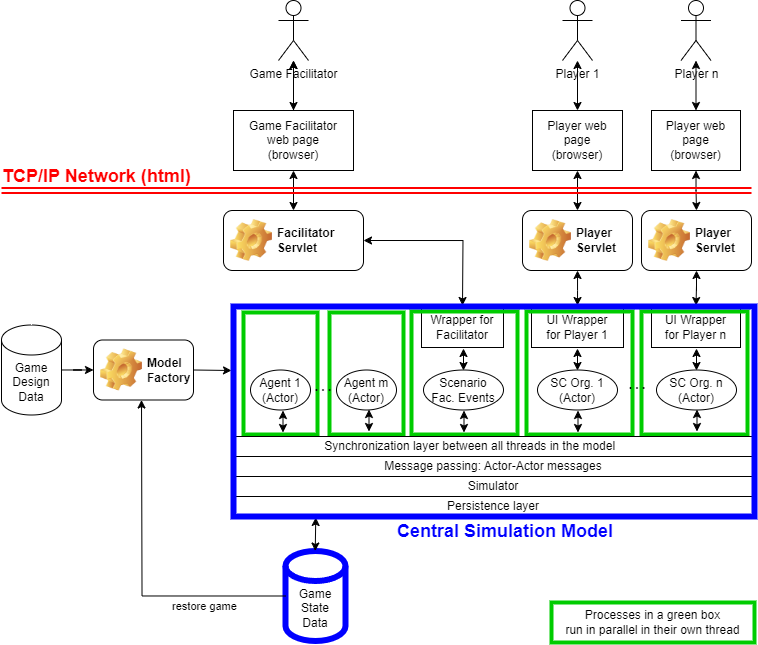
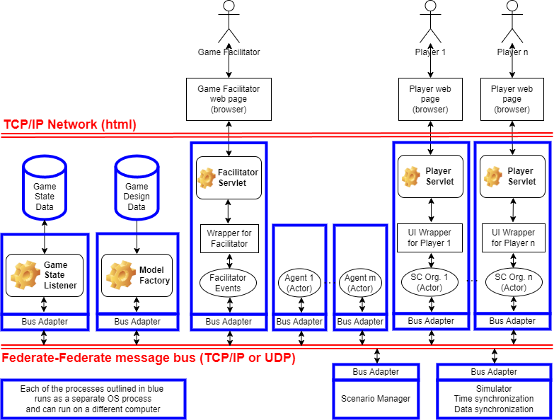

# 6.1. Federates

[Back to Table of Contents](../../README.md)

Last Updated: 2025-09-21

__Changelog:__
 - 2025-09-20 - Document Creation


There are two major options with variants how to set-up the internal architecture of simulation components. These will be discussed below, with their advantages and disadvantages.


## 6.1.1. Central simulation model

### 6.1.1.1 Central simulation model with one execution thread

The old setup of GSCG had a central simulation model. This means one clock, and one shared state. The big advantage is simplicity: starting the model involves one action, and there is one point of contact for the player clients. The big disadvantage is robustness or resilience. One exception in a relatively unimportant part of the simulation can end the game for all players. 

The architecture roughly looks as follows:


In essence, this leads to a single-threaded simulation. Only one event of each Actor is executed at a time. There is no parallel execution of simulation events. This does keep the simulation simple, since causality and a strict ordering of the time of executed events is always guaranteed. Speed is, however, suffering from this setup, since multiple processors are not used for the execution of the simulation.

Since player events and facilitator events are injected into the game through the player servlet and facilitator servlet in a separate thread, extra care has to be taken when the events from players and facilitators are injected into the game. The UI wrappers for the players and the facilitator wrapper need to use a message queue mechanism that is polled by the simulation to ensure that the simulator dictates when the player events and facilitator events are executed.

This leads to the following execution of the simulation model, in pseudo code, where polling is scheduled as a simulation event:

```
void build() {
  simulator.initialize()
  modelFactory.buildSimulation()
  simulator.scheduleEventRel(pollTime, () -> pollUI())
  simulator.start()
}

void pollUI() {
  for (externalData : facilitator.messageQueue)
    process(externalData)
  for (player : players)
    for (externalData : player.messageQueue)
      process(externalData)
  simulator.scheduleEventRel(pollTime, () -> pollUI())
}
```

In this way, by polling events from the UI, all player and facilitator actions are neatly interleaved between the simulation events from the agents, autonomous processes, scenario events, and player-triggered processes. 

| Advantages               | Disadvantages                                                   |
| ----------               | -------------                                                   |
| simplicity               | lack of robustness and resilience; one error kills entire game  |
| causality guaranteed     | slow, single-threaded simulation; not utilizing available cores |
| strict ordering of time  | polling of player and facilitator events                        |
| simple communication between actors: direct calls on other objects |                       |


### 6.1.1.2. Central simulation model with parallel execution threads

A variant on the central simulation model is one where multiple threads exist, that each execute the code for one actor (either an agent or a human player). The simulation is faster than the single-threaded solution, but to the cost of simplicity. Causality and strict ordering of time are not guaranteed by default, and concurrent issues can play a role. 

Therefore, it is very important to use the correct mechanism for time advance. Probably, a time-stepping mechanism using relaxed time synchronization is to be preferred, where all threads can execute their tasks for the current time step in parallel (e.g., for an hour or for a day), where communication between actors, agents and scenario take place at the end of the time step. No objects in *different* threads communicate with each other within the execution of the time step.

The architecture roughly looks as follows:



Polling for player and facilitator events is no longer necessary: the thread can handle the inputs from players and facilitators, where all processed events will be timed at the end of the current time step, e.g., on an hour or day level of precision. Thread synchronization has become a major component / layer in the technical architecture: it has to ensure all threads are ready with their current events before communication takes place, after which the next time step starts. 

| Advantages                      | Disadvantages                                                       |
| ----------                      | -------------                                                       |
| speed through parallelism       | error in synchronization layer, messaging layer or simulator layer kills entire game |
| no polling of events needed     | causality no longer guaranteed, except on a time step level         |
| strict ordering of time steps   | no strict ordering of time for the overall simulation               |
| robust against errors in actors | communication between actors is now indirect and once per time step |


## 6.1.2. Distributed simulation model

If we take the central simulation architecture with parallel execution threads one step further, we arrive at a fully distributed model. Here, actors do not run in their own thread in a combined simulation model, but are completely separate federates that can run on one or more hardware units. This can, in theory, maximize parallelism and is very robust against failure of one of the actor, agent, or facilitator processes. When late joiners are allowed, processes could easily reconnect to the game when they have failed, retrieving their latest state data from the game state data database.

The persistence layer also becomes a federate. Message passing is real, using TCP/IP sockets. Each of the federates needs a bus adapter (in HLA-terminology: ambassador) to synchronize its data and messages with the other federates. All decisions about time advance and communication are guarded by the simulator and time and data synchronization shown in the below diagram at the bottom right (the RTI in HAL terminology).

In theory, the parallel simulation can run in conservative mode or optimistic mode. Given the complexity of the game, optimistic mode is not to be preferred. Neither is conservative time synchronization, given the overhead of the communication and the fact only one computer or process will be executing simulation code at the same time. Also here, a time-stepping mechanism using relaxed time synchronization is to be preferred, where all federates can execute their tasks for the current time step in parallel (e.g., for an hour or for a day), where communication between federates take place at the end of the time step. No objects in *different* threads communicate with each other within the execution of the time step.



When we use 

| Advantages                      | Disadvantages                                                           |
| ----------                      | -------------                                                           |
| speed through parallelism       | error in simulator (RTI) layer kills entire game                        |
| no polling of events needed     | causality no longer guaranteed, except on a time step level             |
| strict ordering of time steps   | no strict ordering of time for the overall simulation                   |
| robust against errors in actors | communication between actors has to use network (can become bottleneck) |
| scalable architecture           | complex architecture to build                                           |


## 6.1.3. Conclusion

The fully distributed architecture is the most robust, since parts can fail where the overall federation can continue. It can also scale better than the other architectures. This does come at a very high cost for building a fully distributed architecture. If the distributed architecture is to be implemented, an HLA RTI (open source such as Portico) will save quite some time in the construction process.

The current simulation models run on a central simulation architecture. The best strategy is probably to *prepare* the technical implementation for distributed execution, but start with a central simulation architecture for the game first.

