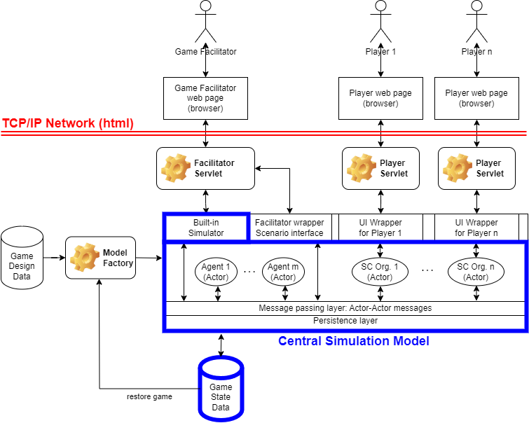

# 7.1. Federates

There are two options how to set-up the internal architecture of simulation components. These will be discussed below, with their advantages and disadvantages.

## 7.1.1. Central simulation model

The old setup of GSCG had a central simulation model. This means one clock, and one shared state. The big advantage is simplicity: starting the model involves one action, and there is one point of contact for the player clients. The big disadvantage is robustness or resilience. One exception in a relatively unimportant part of the simulation can end the game for all players. 

The architecture roughly looks as follows:

